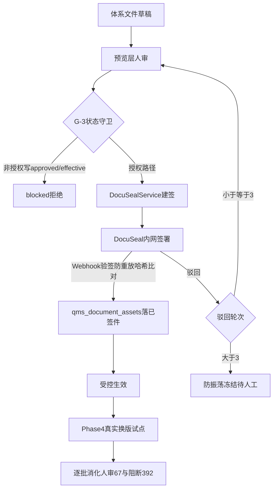

# jewelry-qms 签批与换版流程图 v0.2

> 2026-07-20 · 随 2.2.0 发版准备升版（v0.1 无 DocuSeal 闸门）

## 说明

1. AI / 非 Approval 路径不得直写 `approved` / `effective`（G-3）。
2. DocuSeal 仅 compose profile `signing`，默认不随现用 8010 启动。
3. QMS `users` 为签署身份事实源；控制台管理账号独立强口令。
4. SIMULATED 标记不计完成项。
