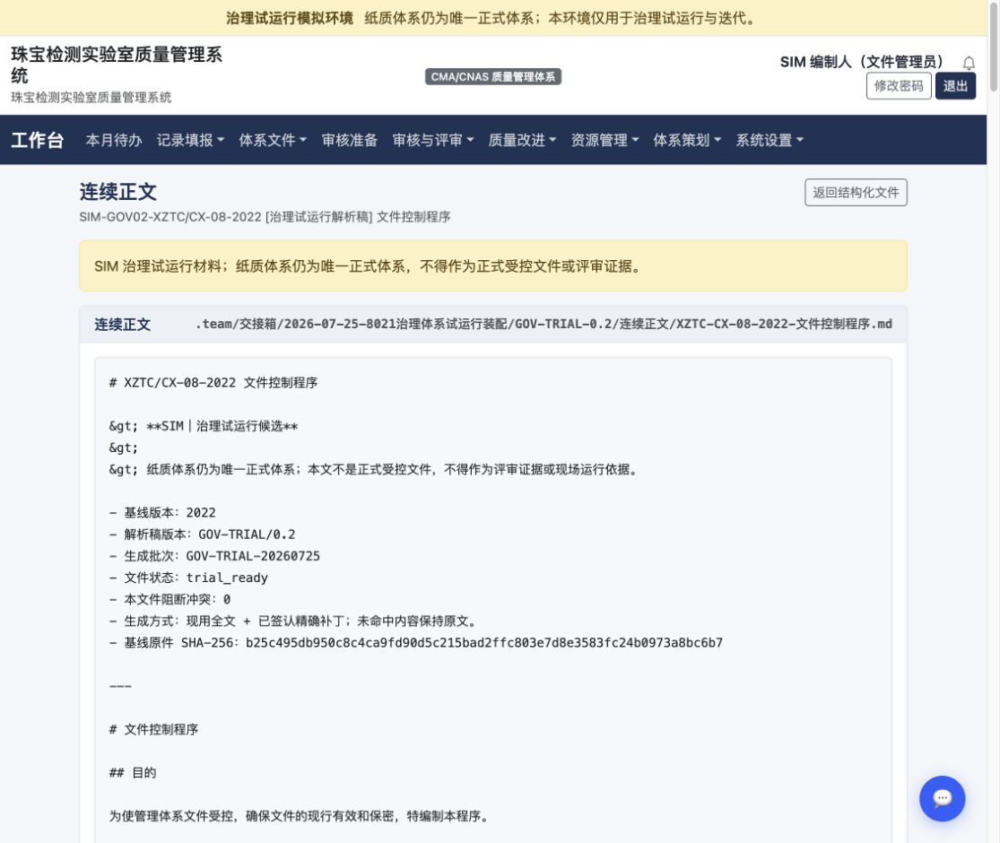
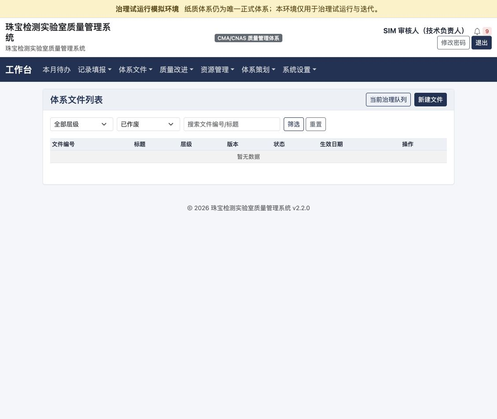
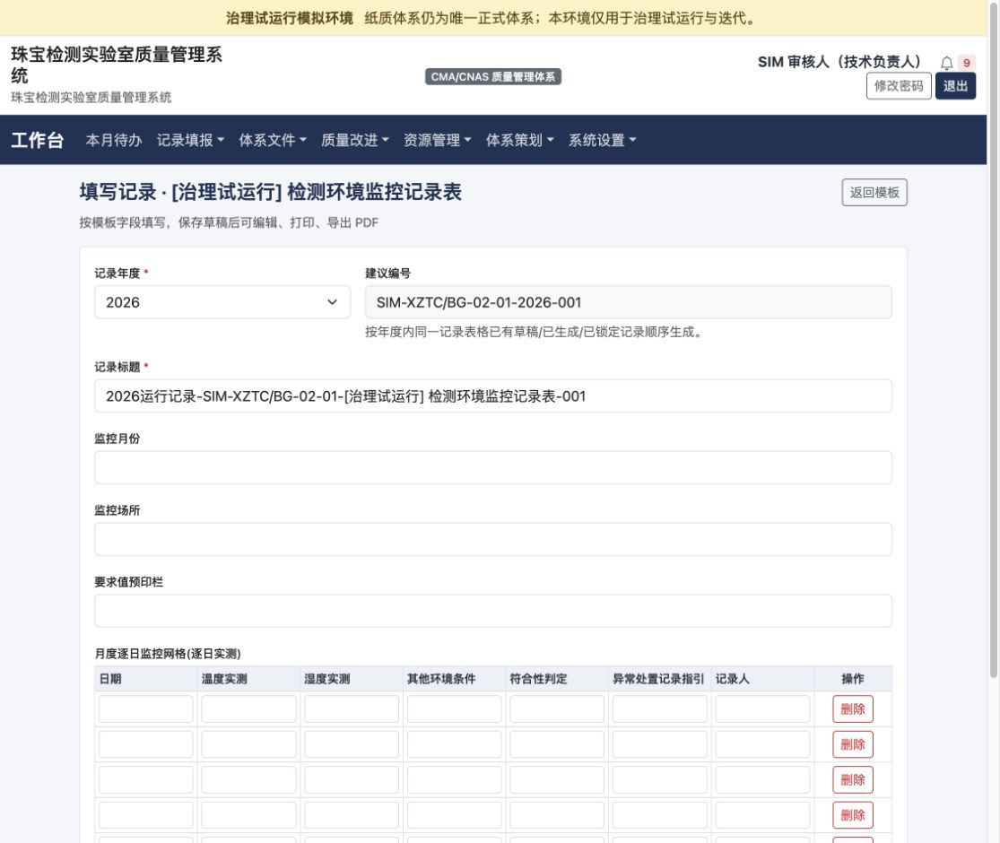
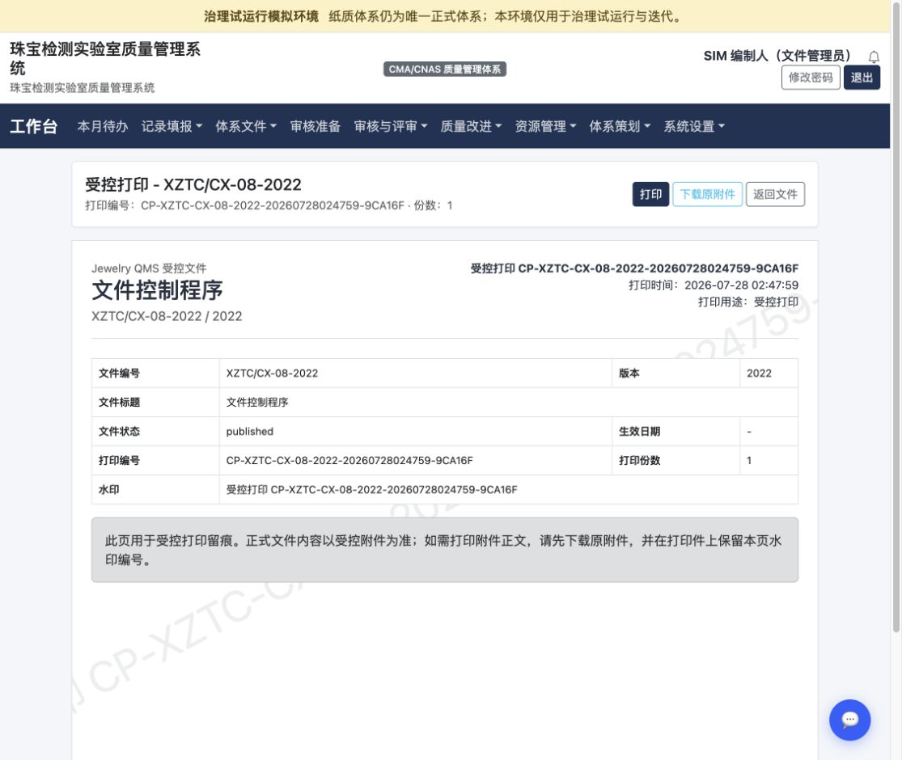

# 8021 四角色真实操作体验审计 v0.1

日期：2026-07-28
环境：`http://127.0.0.1:8021` 治理试运行模拟环境
视窗：1130 × 953，设备像素比 2
方法：浏览器逐步实操、当前页面 DOM 核对、截图复核、少量只读数据库与代码核对
边界：纸质体系仍为唯一正式体系；本报告不是正式内审或 CMA/CNAS 评审结论。

## 任务卡

- 我要做什么：用四种真实业务心智模拟 8021 的找文件、读文件、填记录、审核签字、打印和修订流程。
- 材料在哪里：8021 当前页面、本目录 `证据/` 截图、现行 8021 数据库和代码。
- 不能碰什么：不改代码和配置，不写 8010，不把试运行数据当正式记录。
- 做完怎么算成功：每一步都记录“我看到什么 → 我以为是什么 → 我会点哪里 → 我卡在哪里”，并形成可直接排期的优化建议。

## 审计结论

8021 已经具备可运行的文件、记录、PDF、修订、追溯和受控打印底座，但目前更像“功能集合＋治理工程工作台”，还不是纸质体系人员可以无培训上手的业务系统。

最主要的问题不是页面不美观，而是三类业务语义没有统一：

1. **系统状态与用户任务不一致**：工作台显示“8 件待审核”，技术负责人实际没有待审文件；按“审核中”筛选后，页面又显示“已作废”。
2. **业务阅读与工程排障混在一起**：连续正文显示原始 Markdown、HTML 转义符、本地路径、SHA-256、内部状态值；质量员需要自行翻译。
3. **“已发布”“正式 PDF”“受控打印”等强状态缺少证据前提**：已发布文件可以没有生效日期、审批记录、分发记录和修订记录；受控打印只生成一张留痕页，正文仍需另行下载。

新人填表链是本轮最顺的一条：搜索模板、填写、保存草稿、生成 PDF 都成功，并有明确成功提示。但字段类型、单位、默认值、必填校验和身份自动带入仍不足，容易形成“能保存但数据不规范”的记录。

## 角色与账号覆盖说明

| 模拟视角 | 实际使用身份 | 覆盖限制 |
|---|---|---|
| 不熟悉电脑、熟悉纸质体系的质量员 | `sim_preparer` | 系统把质量员与文件管理员合并为一个身份，无法验证职责分离后的菜单 |
| 了解质量管理、过去只负责技术审核签字的技术负责人 | `sim_reviewer` | 能验证技术负责人看到的工作台、通知和文件筛选 |
| 计算机操作尚可、业务不熟的新人记录员 | 借用 `sim_reviewer` 的 `staff` 权限 | 当前没有独立 `sim_recorder`，页面仍显示“技术负责人”，不能作为最小权限记录员验收 |
| 熟悉办公流程、不了解技术与体系的文件资料管理员 | `sim_preparer` | 能验证文件台账、在线编辑、受控打印和修订入口 |

这不是单纯测试账号不足：它会掩盖“新人是否看到过多管理入口”“质量负责人和资料管理员是否职责越权”等真实可用性与权限问题。

## 一、质量员视角

人物设定：纸质手册、程序和表格很熟，知道编号和受控状态；不熟悉筛选器、内容块、Markdown、哈希和结构化追溯。

| 步骤 | 我看到什么 | 我以为是什么 | 我会点哪里 | 我卡在哪里 | 健康度 | 证据 |
|---|---|---|---|---|---|---|
| 1 | 登录页写明“治理试运行模拟环境”，并提示纸质体系是唯一正式体系 | 这是练习系统，不会替代纸质文件 | 输入账号密码登录 | 边界清楚；“联系系统管理员”仍缺具体电话或入口 | 良好 | [01-登录入口.png](证据/01-登录入口.png) |
| 2 | 工作台有 126 份体系文件、8 件待审核、CAPA、校准、投诉等多块信息 | 这是质量运行总览，8 件待审核应该需要我处理 | 先找“体系文件” | 首屏没有“今天先做什么”；质量员最关心的文件治理任务没有排在前面 | 一般 | [02-质量员工作台首屏.png](证据/02-质量员工作台首屏.png) |
| 3 | “体系文件”展开后有列表、新建、模板管理、分类 | 相当于纸质文件总目录和文控台账 | 点“体系文件列表” | “文件模板管理”与“记录模板”容易混淆；没有“当前有效文件”这一纸质习惯入口 | 一般 | [02-质量员工作台首屏.png](证据/02-质量员工作台首屏.png) |
| 4 | 搜“文件控制程序”得到 2022 已发布、GOV-TRIAL/0.1、GOV-TRIAL/0.2 三条 | 同一文件的原件、旧候选和新候选 | 倾向点最上面的 GOV-TRIAL/0.2 | 列表没有版本树，也没有一句“日常运行看哪份、治理修改哪份”；很容易点错 | 较差 | [03-质量员搜索同名文件结果.png](证据/03-质量员搜索同名文件结果.png) |
| 5 | 文件详情显示“试运行就绪”，但生效日期、部门、分类、复审日期为空；修订说明是一段 JSON | 这应该是文件封面、修订页和受控信息 | 先找正文或附件 | 业务说明被 `notice`、`source_sha256`、`blocking_conflicts` 等工程字段包住；无法快速判断缺什么 | 较差 | [04-质量员文件详情首屏.png](证据/04-质量员文件详情首屏.png) |
| 6 | “结构化文件”页面显示草稿、已渲染、本地 Markdown 路径、内容块和追溯数量 | 可能是系统拆分后的文件目录 | 点“连续正文” | 同一文件在上一页是“试运行就绪”，这里又是“草稿”；“已渲染”也不等于已审核，状态关系不清 | 较差 | [05-质量员结构化追溯页.png](证据/05-质量员结构化追溯页.png) |
| 7 | 连续正文以等宽字体显示 `#`、`##`、`&gt;`、`trial_ready`、SHA-256 和本地路径 | 我以为会看到像 Word/PDF 一样连续可读的文件 | 向下滚动找正文 | 正文没有按标题、段落、目录渲染；纸质文件人员会认为“文件格式坏了” | 阻断 | [06-质量员连续正文阅读.png](证据/06-质量员连续正文阅读.png) |

### 质量员的真实感受

> 我知道文件控制程序讲什么，也知道我要看现行版本，但系统让我先判断“2022、0.1、0.2、试运行就绪、草稿、已渲染”之间的关系。我不是不会质量管理，而是不知道系统把哪一个词当成最终结论。

## 二、技术负责人视角

人物设定：理解质量管理原则，熟悉技术审核和签字，但不熟悉文控、治理工作台和系统筛选规则。

| 步骤 | 我看到什么 | 我以为是什么 | 我会点哪里 | 我卡在哪里 | 健康度 | 证据 |
|---|---|---|---|---|---|---|
| 1 | 工作台显示 8 件待审核、9 条未读通知；下方“待办事项”又显示暂无待办 | 应该有 8 份文件等我审核 | 先点 9 条未读通知 | 三个信号互相矛盾：有待审、有通知、却没有待办 | 较差 | [07-技术负责人工作台首屏.png](证据/07-技术负责人工作台首屏.png) |
| 2 | 通知全部叫“记录更正申请处理结果”，内容被截断，类型显示 `general` | 可能其中一条是要我签的文件 | 逐条点“查看” | 看不到记录编号尾部、申请人、处理结论和是否需我行动；列表也不是按时间倒序 | 较差 | [08-技术负责人通知中心.png](证据/08-技术负责人通知中心.png) |
| 3 | 返回工作台后点“查看全部”，进入 126 份文件总表 | 待审核文件应该排在最前或已自动筛选 | 找状态筛选器 | 实际没有“我的待审核”，只能自己选择“审核中” | 一般 | [07-技术负责人工作台首屏.png](证据/07-技术负责人工作台首屏.png) |
| 4 | 选择“审核中”并筛选后，地址参数是 `status=reviewing`，页面却显示“已作废”，表格为空 | 我会以为自己选错了，或待审文件已作废 | 反复重选、返回、刷新 | 这是确定性的筛选显示错误；技术负责人无法再信任状态筛选 | 阻断 | [09-技术负责人审核筛选空结果.png](证据/09-技术负责人审核筛选空结果.png) |
| 5 | 数据库中当前没有分配给 `sim_reviewer` 的 pending 审批 | 8 件待审核本来就不是“我的待审核” | 无处可点 | 工作台把 8 份草稿也计为待审核，错误制造了任务预期 | 阻断 | [07-技术负责人工作台首屏.png](证据/07-技术负责人工作台首屏.png) |

### 已确认的代码原因

1. `Dashboard.php` 将全部 `draft + reviewing` 文件计为“待审核”，没有按当前审核人过滤：
   - `jewelry-qms/app/controller/Dashboard.php:38`
2. 真正的个人审批数在 `pendingApprovals`，但只有大于 0 才进入下方待办：
   - `jewelry-qms/app/controller/Dashboard.php:56`
   - `jewelry-qms/app/controller/Dashboard.php:86-89`
3. 状态筛选模板条件缺少明确括号，任何非空状态可能使多个 option 同时带 `selected`，浏览器最终显示最后一项“已作废”：
   - `jewelry-qms/app/view/document/index.html:23-28`

### 技术负责人的真实感受

> 我习惯收到一份文件、看修订内容、写审核意见、签字。现在系统先告诉我有 8 件，再让我去 126 份里筛，筛完又变成已作废。我会先停下来问质量负责人，不敢在系统里继续点。

## 三、新人记录员视角

人物设定：计算机操作没有障碍，但不知道程序文件、记录模板、状态、留痕和更正规则；只知道“今天要填环境温湿度”。

| 步骤 | 我看到什么 | 我以为是什么 | 我会点哪里 | 我卡在哪里 | 健康度 | 证据 |
|---|---|---|---|---|---|---|
| 1 | “记录填报”菜单下有“记录模板”“填写记录”“年度运行确认”“模板复核” | “填写记录”应该就是开始填一张新表 | 点“填写记录” | 实际进入的是已填写记录列表，不是新建页面；“模板”与“填写”关系需要猜 | 一般 | [10-新人填写记录列表.png](证据/10-新人填写记录列表.png) |
| 2 | 列表第一屏全是“已生成（不可直接编辑）”，还有查看、灰色编辑、打印预览、灰色生成 PDF | 这些可能是今天要继续填写的表 | 尝试点编辑，或找空白行 | 表头被挤成逐字换行；大量历史/预置实例占据首屏；真正的新建入口藏在右上角“选择模板填写” | 较差 | [10-新人填写记录列表.png](证据/10-新人填写记录列表.png) |
| 3 | 模板列表有编号、模块、版本、状态、打印模板和“查看/填写” | 这是空白表格目录 | 搜“检测环境监控记录表”，点“填写” | `g2_expansion_batch2_record` 等打印模板内部值不应给普通记录员看；也没有“最近使用/我的岗位常用” | 一般 | [10-新人填写记录列表.png](证据/10-新人填写记录列表.png) |
| 4 | 表单有年度、建议编号、标题、监控月份、场所、要求值和 5 行网格 | 像纸质表格，可以开始录入 | 逐格填写 | “要求值预印栏”不知该填标准范围还是实测值；日期、月份、温度、湿度、符合性、记录人都是自由文本 | 一般 | [11-新人环境监控表空白页.png](证据/11-新人环境监控表空白页.png) |
| 5 | 输入 `22.5℃`、`45%RH`、`符合` 等可以正常显示 | 系统会校验单位、范围和是否符合 | 点“保存草稿” | 实际没有单位、数值范围或枚举校验；记录人也没有自动带入当前身份，容易产生多种写法 | 较差 | [12-新人环境监控表已填写.png](证据/12-新人环境监控表已填写.png) |
| 6 | 保存后出现明确绿色提示，可继续编辑或生成 PDF | 草稿保存成功，我还能检查 | 检查内容后点“生成PDF” | 这一段反馈清晰，是本轮正面样例 | 良好 | [13-新人草稿保存反馈.png](证据/13-新人草稿保存反馈.png) |
| 7 | 生成后明确提示记录已锁定，并提供下载 PDF、申请更正和批注模式 | 这张记录已经不能直接改了 | 有错时会找“申请更正” | 页面同时出现“申请更正”和“进入批注模式”，用户不清楚批注是否仍需审批；“正式 PDF”在试运行环境也容易被误解 | 一般 | [13-新人草稿保存反馈.png](证据/13-新人草稿保存反馈.png) |

### 已确认的结构原因

- 该模板蓝图把所有字段默认定义成文本：
  - `jewelry-qms/app/service/G2ExpansionBatch2BlueprintService.php:13-25`
- 通用填表页本来支持日期、数字、选择和人员控件，但模板没有提供这些类型：
  - `jewelry-qms/app/view/record_form_instance/create.html:38-73`
- 重复表格输入框没有逐格可访问名称，DOM 中只能识别为一串匿名 textbox；列标题不能替代每个输入框的程序化标签：
  - `jewelry-qms/app/view/record_form_instance/create.html:93-130`

### 新人记录员的真实感受

> 我能把内容填进去，也能保存和出 PDF，但我不知道自己填的格式对不对。系统更像电子空白纸，没有像有经验的老师那样告诉我月份格式、温湿度单位、正常范围和异常时该做什么。

## 四、文件资料管理员视角

人物设定：熟悉收文、发文、编号、分发、回收、归档、打印和换版；不懂 Markdown、结构化服务、哈希或在线编辑服务配置。

| 步骤 | 我看到什么 | 我以为是什么 | 我会点哪里 | 我卡在哪里 | 健康度 | 证据 |
|---|---|---|---|---|---|---|
| 1 | 同名文件有已发布 2022、试运行 0.1、治理候选 0.2 | 2022 是现用纸质版，0.2 是正在治理的新版本 | 打开“已发布”版本查看台账 | 系统没有版本链，只能靠标题前缀和经验判断 | 较差 | [03-质量员搜索同名文件结果.png](证据/03-质量员搜索同名文件结果.png) |
| 2 | 已发布文件没有生效日期、归口部门、分类、复审日期、修订说明、分发、评审、审批和修订历史 | 既然已发布，这些受控证据应该完整 | 打开“更多”找管理功能 | “已发布”只代表数据库状态，页面没有提醒“这是来源归档，不是系统内完成发布” | 阻断 | [14-资料管理员已发布文件操作菜单.png](证据/14-资料管理员已发布文件操作菜单.png) |
| 3 | 更多菜单在已发布文件上仍显示“在线编辑” | 可能可以直接改现行受控文件 | 点“在线编辑” | 进入后才提示服务未配置；入口没有提前禁用，也没有说明已发布文件只能只读或走修订 | 较差 | [15-资料管理员在线编辑未配置.png](证据/15-资料管理员在线编辑未配置.png) |
| 4 | 点“受控打印”后立刻生成打印编号和 1 份打印记录 | 进入后应该先选份数、用途、接收人和受控/非受控 | 点“受控打印” | 系统在确认真实打印前已留痕；用户无法填写用途、份数、发放编号或接收人 | 阻断 | [16-资料管理员受控打印页.png](证据/16-资料管理员受控打印页.png) |
| 5 | 打印页只有封面留痕，正文仍需“下载原附件”，并要求人工保留本页水印编号 | 打印按钮应该输出带编号水印的完整受控副本 | 点打印或下载原附件 | 封面和正文可能分离；正文自身没有强制水印，无法证明每一页属于哪个受控副本 | 阻断 | [16-资料管理员受控打印页.png](证据/16-资料管理员受控打印页.png) |
| 6 | 发起修订页只有“修订原因”和“上传新附件” | 换版应能看到原版本、拟版本、变更范围、审批路线和生效安排 | 填原因并提交 | 没有拟版本号、修订/换版选择、差异预览、责任人和审批路线预告；提交后的结果不可预判 | 较差 | [17-资料管理员发起修订页.png](证据/17-资料管理员发起修订页.png) |

### 已确认的代码原因

1. 在线编辑入口只判断“有附件”，没有判断服务是否启用，也没有按文件状态改为“只读预览”：
   - `jewelry-qms/app/view/document/view.html:36-39`
   - `jewelry-qms/app/view/document/onlyoffice.html:12-23`
2. 受控打印入口用隐藏字段固定用途为“受控打印”，没有让用户填写份数和用途：
   - `jewelry-qms/app/view/document/view.html:40-45`
3. 后端默认份数为 1、用途为“受控打印”，点击即创建日志：
   - `jewelry-qms/app/controller/Document.php:400-426`
4. 当前打印页明确要求正文另行下载，未生成合并后的水印正文：
   - `jewelry-qms/app/view/document/controlled_print.html:50-111`

### 文件资料管理员的真实感受

> 系统会给我一个打印编号，但它没有先问我要打几份、给谁、什么用途；打印出来又只有一张封面，正文要另下。我会担心账上有一份、实际没打印，或者正文和封面分开后失控。

## 最高优先级优化建议

### P0-1 建立“我的工作”而不是全库数字

工作台只显示当前登录人真正可处理的任务：

- 我的待审核文件；
- 我的待批准文件；
- 我的待确认分发/回收；
- 我的待处理更正；
- 我的待填写记录。

“全库有 8 份草稿”应改成治理统计，不得叫“8 件待审核”。每张任务卡直接进入已经按当前人筛好的清单。

### P0-2 立即修复状态筛选器

对模板比较表达式加明确括号，并增加浏览器回归：

- 请求 `status=reviewing` 时，筛选器必须显示“审核中”；
- 表格结果只能包含 `reviewing`；
- 无结果时显示“当前没有分配给您的审核任务”，不能只写“暂无数据”；
- 对 draft、approved、published、trial_ready、obsolete 全部做同样回归。

### P0-3 连续正文改成“业务阅读模式”

默认页面应呈现：

- 文件封面信息；
- 自动目录；
- 按标题层级渲染的连续正文；
- 当前治理候选醒目标识；
- 下载 Word/PDF；
- “查看技术信息”折叠区。

Markdown 源码、本地路径、内部状态、SHA-256 和生成批次放入技术折叠区。现有模板明确使用 `<pre>` 和 `htmlspecialchars`，应增加安全 Markdown 渲染，而不是简单去掉转义：

- `jewelry-qms/app/view/planning_structure/resolved_artifact.html:15-21`

### P0-4 重新定义“已发布”的证据门槛

在 8021 中至少拆成：

- 纸质现用来源；
- 电子治理候选；
- 电子试运行就绪；
- 电子受控发布。

电子受控发布必须同时具备生效日期、版本、审批链、附件快照、分发范围和发布人。旧纸质导入件缺少电子证据时，应标“纸质现用来源”，不能仅显示“已发布”。

### P0-5 重做受控打印为“申请 → 生成 → 打印 → 发放/回收”

点击“受控打印”先打开表单，至少填写：

- 份数；
- 用途；
- 接收人或使用场所；
- 是否允许打印；
- 水印类型；
- 备注。

确认后生成合并 PDF：受控封面＋正文逐页水印＋页码＋副本编号。只有实际生成文件后才记“已生成”；用户点击浏览器打印后记录“已打印”；交给接收人后记录“已发放”。不要用一次点击同时代替三个动作。

### P0-6 已发布文件禁止出现无条件“在线编辑”

- 在线编辑服务未启用：隐藏入口或显示禁用状态，并直接说明“当前未启用”。
- 已发布文件：只能“在线阅读”；任何内容修改必须从“发起修订”产生新草稿版本。
- 修订页在提交前预告拟版本、原版本保留方式、附件差异和后续审核路线。

### P1-1 给新人一个“我要填什么”入口

默认入口不再是全量模板台账，而是：

1. 我的岗位常用表；
2. 最近填写；
3. 按业务场景找表；
4. 搜索全部模板。

普通记录员隐藏“打印模板”“模板复核”等维护字段；“填写记录”改名为“已填记录”，“开始填一张新表”作为主按钮。

### P1-2 把环境监控表从电子空白纸升级为受约束记录

- 监控月份：月份选择器；
- 日期：日期控件；
- 温度、湿度：数值字段＋固定单位；
- 要求值：根据场所或程序自动带入，只读显示；
- 符合性：符合/不符合选择；
- 异常处置：不符合时必填，并链接不符合/CAPA；
- 记录人：自动带当前用户，允许有权限人员代填时注明代填；
- 至少一行实测数据必填；
- 每格增加程序化标签，支持键盘和屏幕阅读器。

### P1-3 通知改成“对象＋结论＋下一步”

通知列表至少显示：

- 对象编号和完整标题；
- 发生了什么；
- 处理结论；
- 是否需要我行动；
- 发起人/处理人；
- 时间；
- 唯一主操作。

把 `general` 翻译为业务类型；相同记录的多次通知折叠成时间线；默认按最新时间倒序。

### P1-4 默认列表清理测试污染

`D35 signing loop smoke`、重复 SIM 回归文件及历史测试件不应出现在普通业务清单首屏。建议增加 `data_scope=test` 或独立测试公司/租户，普通列表默认排除；需要排障时由“显示测试数据”开关进入。

## 与既有清单的关系

本轮不是重复建立另一份“大清单”：

- 再次证实：同编号多版本并列、修订说明 JSON、内部路径、信息密度高等既有问题仍存在。
- 本轮新增或明显加重：技术负责人待审数字错误、状态筛选显示错误、连续正文未渲染、已发布证据不完整、在线编辑假入口、受控打印链条不完整、新人模板字段类型不足、专用记录员账号缺失。
- 建议将本报告作为场景层验收依据，把可开发项并回现有软件优化清单，不另建重型项目管理体系。

## 可访问性风险与证据限制

本轮可确认：

- 重复表格内的输入框缺少逐格可访问名称；
- 长表在正常桌面宽度下已出现逐字换行；
- 重要状态虽然有文字，不只依赖颜色，这是优点；
- 保存和 PDF 生成后的提示已进入辅助功能树，也是优点。

本轮没有完成屏幕阅读器实测、全量键盘遍历、200% 缩放、窄屏和移动端复核，因此不能据此声称符合完整 WCAG 要求。

## 本轮生成的试运行痕迹

为验证真实操作链，本轮在 8021 沙箱生成了以下明确标记的测试痕迹，未写 8010：

1. 记录实例：
   - ID：`f5808a33-768f-4a6c-80f1-5da7dd739338`
   - 标题：`SIM-2026运行记录-SIM-XZTC/BG-02-01-[UX模拟]检测环境监控记录表-001`
   - 状态：已生成 PDF、已锁定
2. 受控打印日志：
   - 文件：`XZTC/CX-08-2022 文件控制程序`
   - 打印编号：`CP-XZTC-CX-08-2022-20260728024759-9CA16F`
   - 份数：1

这些痕迹应保留到本轮验收完成；如需清理，应单独确认并按沙箱测试数据清理流程执行。

## 四个关键卡点截图

### 质量员：连续正文仍以原始 Markdown 展示

### 技术负责人：选择“审核中”后界面却显示“已作废”

### 新人记录员：关键字段仍是无类型、无单位约束的普通文本框

### 文件资料管理员：受控打印只生成封面，正文仍需另行下载拼接

## 证据截图索引

1. [登录入口](证据/01-登录入口.png)
2. [质量员工作台首屏](证据/02-质量员工作台首屏.png)
3. [同名文件搜索结果](证据/03-质量员搜索同名文件结果.png)
4. [文件详情首屏](证据/04-质量员文件详情首屏.png)
5. [结构化追溯页](证据/05-质量员结构化追溯页.png)
6. [连续正文阅读页](证据/06-质量员连续正文阅读.png)
7. [技术负责人工作台](证据/07-技术负责人工作台首屏.png)
8. [技术负责人通知中心](证据/08-技术负责人通知中心.png)
9. [审核筛选异常](证据/09-技术负责人审核筛选空结果.png)
10. [新人记录列表](证据/10-新人填写记录列表.png)
11. [新人空白填表页](证据/11-新人环境监控表空白页.png)
12. [新人已填写表单](证据/12-新人环境监控表已填写.png)
13. [新人草稿保存反馈](证据/13-新人草稿保存反馈.png)
14. [已发布文件操作菜单](证据/14-资料管理员已发布文件操作菜单.png)
15. [在线编辑未配置](证据/15-资料管理员在线编辑未配置.png)
16. [受控打印页](证据/16-资料管理员受控打印页.png)
17. [发起修订页](证据/17-资料管理员发起修订页.png)
