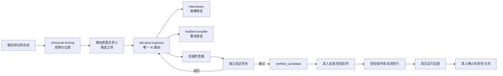

# LIMS-zhj 持续治理闭环设计 v0.3.1 复审与角色权限矩阵

> 复审日期：2026-07-19  
> 复审对象：`/Users/lc.leixyz/Downloads/LIMSzhj持续治理闭环设计v0.3.1.md`  
> 对象 SHA-256：`319321896400c3e42c0f7417d415462dbd45d22a458a4b4285f11ac0b9254520`  
> 输出性质：设计复审意见 + 目标态角色权限矩阵  
> 工作边界：只读复审；未修改 v0.3.1 原文件，未修改或安装技能，未写数据库，未发布、批准或废止任何受控文件  
> 重要声明：本文中的真人职责分配是**候选矩阵**，须结合机构现行职责文件确认后才能成为正式授权依据

---

## 1. 总体结论

### 1.1 复审判定

v0.3.1 已经完整吸收上一轮关于状态模型、适用性画像、三轴分类、独立验证、成熟度分层和 LIMS 真实基线的主要修改意见。

本轮判定为：

> **设计主干通过；完成 5 项实施前文字和权限校准后，可进入“主证据矩阵样例 + 治理角色卡”试点设计。**

这里的“设计主干通过”只表示规则模型已经具备继续工程化的条件，不表示：

- 机构已经批准该设计；
- 技能包已经完成改造；
- 角色已获得真实系统权限；
- 受控文件已经批准或生效；
- LIMS 已获正式写入授权；
- CAPA 已经关闭；
- 体系已经通过 CNAS/CMA 评审。

### 1.2 v0.3.1 已经解决的问题

以下内容可以作为后续实现基线：

- 单一 11 状态链已改为公共主干加 4 条处置分支；
- `verified_candidate` 已与真人批准、生效和运行有效性区分；
- 适用性画像增加了版本、哈希和重新开启条件；
- 问题领域补入“技术活动与业务过程”；
- 证据等级改为证据与结论状态；
- 处置路线与真人闸门拆分；
- 主证据矩阵补入状态、责任人、风险和环境指纹；
- 独立验证增加会话隔离、只读和禁止自改要求；
- 成熟度已改为 L1 至 L5；
- LIMS 部分已按六份 CSV、manifest、现有服务代码和 SQL 关系链填实；
- 历史方案从“自动作废”改为“拟替代、待批准后废止”；
- 软件清单不归因与实验室内部 CAPA 原因评价的边界已经校准。

### 1.3 三轴取值复审结论

v0.3.1 的：

- 8 个问题领域；
- 6 个证据与结论状态；
- 8 条处置路线；

已经足以支撑第一版试点，不需要继续扩充分类数量。

实施时应满足：

- 枚举值版本化；
- 问题领域和处置路线允许多选；
- `human_gate` 单独记录；
- “沙箱噪声”作为环境或结论标签，不混入证据状态；
- 后续新增枚举须升版，不直接改写历史记录。

---

## 2. 实施前仍需校准的 5 项问题

> 下列等级表示对设计实施的影响，不是对实验室开具的正式不符合等级。

| 编号 | 问题 | 影响 | 处理建议 |
|---|---|---:|---|
| R-01 | “正式 apply 一律真人”与“受权操作者/系统可执行”表述冲突 | 高 | 改为“正式 apply 必须经真人授权，由受权操作者或系统执行” |
| R-02 | `approved_authorized` 合并了文件批准与生产 apply 授权 | 高 | 拆成 `approved` 和 `apply_authorized` |
| R-03 | 现有角色矩阵漏掉 interviewer、rehearsal-testing、机器检查器及真实业务责任人 | 高 | 采用本文第 6 至 12 节目标态矩阵 |
| R-04 | “主证据矩阵是受控记录”在设计未批准时表述过早 | 中 | 改为“实施后应纳入记录控制” |
| R-05 | v0.3.1 设计已更新，但现有技能包仍是旧状态机和旧治理口径 | 高 | 先改技能引用和状态模型，再开展持续运行试点 |

### 2.1 R-01：批准、授权与执行必须分开

v0.3.1 第 1 节写“正式 apply 一律真人”，第 6 节又允许“受权操作者/系统”条件执行正式 apply。

建议统一为：

> 正式 apply 属于高风险生产动作，必须先取得真人明确授权；获得授权后，可以由受权操作者或受控系统执行。执行结果、操作者、时间、包版本和审计记录必须留痕。

对应职责：

- 真人：批准内容、授权执行；
- 操作者或系统：执行；
- 系统记录：证明是否真正应用；
- AI：准备候选和验证证据，不执行正式 apply。

### 2.2 R-02：拆分 `approved` 与 `apply_authorized`

文件被批准，不一定表示已经允许立即写入 LIMS；生产 apply 授权也不等同于受控文件内容批准。

文件/模板治理分支建议改为：

`candidate_generated → machine_checked → independent_verified → verified_candidate → pending_human_approval → approved → pending_apply_authorization → apply_authorized → applied → effective → effectiveness_confirmed`

其中：

- `approved`：受控内容得到授权批准；
- `apply_authorized`：允许在指定环境、指定包版本、指定时间执行正式 apply；
- `applied`：执行成功且有审计证据；
- `effective`：完成机构规定的生效、发放、启用和必要培训；
- `effectiveness_confirmed`：真实运行证据证明措施有效。

对不需要写入 LIMS 的文件，可将 `pending_apply_authorization`、`apply_authorized` 和 `applied` 标为 `not_applicable`，但不得静默留空。

### 2.3 R-03：现有第 6 节矩阵只能作概览

现有矩阵没有明确：

- lab-profile-interviewer 的事实采集边界；
- rehearsal-testing 与模拟岗位角色的区别；
- 模拟质量负责人可调用谁；
- engineer 能写哪些状态；
- builder 与 compiler 分别能写什么；
- 机器检查器和独立验证者的不同；
- 用户保留拍板权与机构正式批准权的区别；
- 质量负责人、技术负责人、文控等真实职责；
- 每个角色失败后向谁交接。

本文第 6 至 12 节给出完整候选矩阵。

### 2.4 R-04：主证据矩阵应纳入记录控制

v0.3.1 当前写“主矩阵是受控记录”，但本设计尚处于只讨论阶段。

建议改为：

> 主证据矩阵在治理机制正式批准并投入运行后，应纳入 ISO/IEC 17025 第 8.4 条的记录控制，明确识别、保存、保护、备份、检索、保留、访问和重开历史。

试点阶段可先称：

`治理主证据矩阵候选/演练记录`

不得提前冒充机构正式受控记录。

### 2.5 R-05：目标设计与当前技能包仍有差距

v0.3.1 已经更新设计，但当前 `labqmsskillspack20260718.zip` 中的技能仍保留旧口径：

- `lab-qms-engineer` 使用“未启动 → 画像就绪 → 构建中 → 机判 → 语义已签 → 已总装 → 已发布 → 运行中”的旧状态机；
- `governance-loop.md` 仍只分“软件问题/体系文件问题”两类；
- `governance-loop.md` 仍写“持续治理直到体系完善并通过评审”；
- `governance-loop.md` 仍把 compiler 输出称为“受控版”，并把沙箱同步和关闭写进自动单圈；
- `rehearsal-testing` 仍采用旧四级互斥判定，并保留“根因规律”措辞；
- `lab-qms-compiler` 仍把“生成发布版”和“正式生效”写得过近；
- 当前技能包没有单独的模拟质量负责人技能，它应先作为 engineer 编排下的治理角色卡存在。

因此，本文权限矩阵描述的是**目标态**，不是当前技能包已经具备的权限。

---

## 3. 权限设计原则

### 3.1 默认拒绝

角色没有被明确授予的动作，一律视为禁止。

不得因为：

- 角色名称中含“质量负责人”；
- AI 能生成文件；
- 脚本可以运行；
- 测试已经通过；
- 操作者拥有系统管理员账户；

就自动推定其拥有批准、发布、生产写入或 CAPA 关闭权限。

### 3.2 候选权与正式权分离

AI 可以拥有较高的候选治理权限：

- 发现；
- 举证；
- 分流；
- 生成候选；
- 运行机器检查；
- 独立验证；
- 退回和重开候选；
- 生成待批准包。

真人保留组织责任：

- 机构事实和重要适用性确认；
- 受控文件批准；
- 质量手册和结构变化决定；
- 程序新增或废止决定；
- 正式 apply 授权；
- CAPA 正式关闭；
- 真实运行有效性确认。

### 3.3 生成者不作最终独立验证

整改者不得担任同一候选的最终独立验证者或正式批准者。

允许：

- 发现者参与整改；
- engineer 组织复验；
- 同一底层模型以不同隔离实例承担不同角色。

禁止：

- 同一角色实例一边修改候选，一边给自己的候选最终通过；
- 独立验证者在验证中直接修改被验证候选；
- builder 或 compiler 自行写入 `verified_candidate`；
- 模拟质量负责人将自己的调度结果视为已独立验证。

### 3.4 冻结输入后再验证

进入机器检查或独立验证前，应冻结：

- 候选版本；
- 候选哈希；
- 依据版本；
- 适用性画像版本；
- 测试环境指纹；
- 验收标准；
- 本轮变更范围。

候选一旦变化，原验证结果失效，应生成新轮次并重新验证。

### 3.5 状态变化必须有证据

每次状态变化至少记录：

- `finding_id`
- `from_state`
- `to_state`
- `actor_role`
- `actor_or_instance_id`
- `transition_time`
- `evidence_reference`
- `candidate_hash`
- `authorization_reference`（如适用）

状态不能只凭聊天中的一句“完成了”推进。

### 3.6 测试期与整改期分离

rehearsal-testing 在一个场次执行期间：

- 只观察；
- 只操作隔离沙箱；
- 只记录证据；
- 不修改被测系统源码和候选文件。

场次关闭后，engineer 才能开启新的整改轮次并调用 builder/compiler。

整改完成并冻结新候选后，再启动新的独立复验场次。

这既保留 rehearsal-testing 的“测试期只记问题不改系统”红线，也能实现治理闭环持续运行。

---

## 4. 角色体系总览

### 4.1 AI 与自动化角色

| 编号 | 角色 | 类型 | 一句话职责 |
|---|---|---|---|
| AI-01 | lab-profile-interviewer | AI 技能 | 采集机构事实、参数和条件开关，未确认内容保持待定 |
| AI-02 | 模拟岗位角色组 | AI 角色卡 | 按真实岗位目标在隔离沙箱执行场景并留下 SIM 证据 |
| AI-03 | rehearsal-testing | AI 测试引擎 | 规划场次、整理证据、形成候选发现和复验结论 |
| AI-04 | 模拟质量负责人 | AI 治理角色卡 | 分级、候选立项、请求分流、退回和重开，不直接整改 |
| AI-05 | lab-qms-engineer | AI 总编排技能 | 维护治理状态、拆工单、调技能、验交接、控制节奏 |
| AI-06 | lab-qms-builder | AI 整改技能 | 按冻结依据和画像生成逐条/逐字段溯源的整改候选 |
| AI-07 | lab-qms-compiler | AI 装配技能 | 把已验收底稿组装为非受控候选包并运行装配闸门 |
| AI-08 | 机器检查器 | 自动化服务 | 执行结构、覆盖、回链、残留、契约和 dry-run 检查 |
| AI-09 | 独立验证角色 | 隔离 AI/验证角色 | 在只读、隔离上下文中验证冻结候选，不就地修复 |

### 4.2 真人与系统角色

| 编号 | 角色 | 类型 | 一句话职责 |
|---|---|---|---|
| H-01 | 用户/治理拍板人 | 真人 | 对用户保留事项作出是否纳入、变更、新增、废止和扩大范围决定 |
| H-02 | 机构质量负责人或授权质量责任人 | 真人 | 按机构职责审查体系适宜性、批准或组织 CAPA 关闭 |
| H-03 | 技术负责人或技术责任人 | 真人 | 审查方法、技术活动、结果有效性和技术资源相关内容 |
| H-04 | 过程/业务责任人 | 真人 | 确认实际流程、记录字段、措施可执行性和运行证据 |
| H-05 | 文控责任人 | 真人 | 控制编号、版本、发放、回收、旧版标识和生效记录 |
| H-06 | 人员培训/授权责任人 | 真人 | 确认能力要求、培训、监督、授权和再评价证据 |
| H-07 | 设备/资源责任人 | 真人 | 确认设备、设施、环境、校准和期间核查等事实与措施 |
| H-08 | 授权签字人 | 真人 | 仅在其获授权范围内复核并授权结果报告，不自动拥有全部 QMS 批准权 |
| H-09 | LIMS apply 授权人 | 真人 | 对指定环境、包版本、时间窗和回退方案作生产 apply 授权 |
| SYS-01 | 受权操作者/受控执行系统 | 人机执行 | 按授权执行 apply，生成不可抵赖的执行和审计证据 |
| EXT-01 | 软件开发团队 | 外部协作 | 接收软件清单、修复代码、提供修复版本与开发验证证据 |

说明：

- H-01 至 H-09 可能由同一人兼任，但必须按机构真实职责记录当前“帽子”；
- 兼任不等于可以跳过独立性、批准或授权记录；
- ISO/IEC 17025 要求职责、责任和权限被明确传达，但不强制实验室使用上述岗位名称；
- 最终岗位名称和签批关系应以机构现行手册、程序、任命和授权文件为准。

---

## 5. AI 角色权限总矩阵

### 5.1 权限标识

| 标识 | 含义 |
|---|---|
| 允许 | 可在授权范围内直接执行 |
| 条件允许 | 满足冻结基线、工单或前置闸门后执行 |
| 建议 | 可提出建议，但不能推进正式状态 |
| 只读 | 可读取，不可修改 |
| 禁止 | 不得执行 |

### 5.2 汇总矩阵

| 角色 | 读取范围 | 写入范围 | 可调用对象 | 可推进的最高状态 | 主要禁止动作 | 失败交接 |
|---|---|---|---|---|---|---|
| AI-01 interviewer | 历史答卷、现行画像、机构提供证据 | 答卷候选、P/C/F 候选、未决项 | `profile_check` | `provisional` 画像候选 | 代拍板、脑补事实、确认重大适用性 | H-01 / AI-05 |
| AI-02 模拟岗位角色 | 冻结剧本、程序、画像、沙箱数据 | SIM 原始记录、现场观察 | 仅被测沙箱功能 | `observed` | 修改候选、改系统源码、正式签字 | AI-03 |
| AI-03 rehearsal-testing | 冻结基线、剧本、SIM 证据、环境指纹 | 场次记录、证据包、候选发现、复验报告 | 测试工具；不调 builder/compiler | `evidence_assessed` | 根因定性、生产操作、测试中整改 | AI-04 / AI-05 |
| AI-04 模拟质量负责人 | 主证据矩阵、适用性画像、场次证据 | 候选分级、立项、退回、重开请求 | 只调用 AI-05 | `finding_accepted` | 直接改文件、调用正式 apply、批准/关闭 | AI-05 / H-01 |
| AI-05 engineer | 全部治理候选记录、台账和工单 | 路由、工单、状态事件、交接记录 | AI-01/03/06/07/08/09 | `route_assigned`；记录 `verified_candidate` | 代子技能写内容、豁免停点、正式批准 | 相应真人闸门 |
| AI-06 builder | 冻结要求、画像、工单、现行候选源 | 逐条/逐字段溯源候选、影响分析 | builder 校验脚本 | `candidate_generated` | 改机构事实、处理真冲突、验证自己候选 | AI-05 |
| AI-07 compiler | 已验收底稿、版本台账、装配规则 | 非受控装配候选、候选发布包、闸门报告 | compiler 三闸脚本 | `candidate_generated` | 标正式生效、手改发布件、绕过签字和三闸 | AI-05 |
| AI-08 机器检查器 | 冻结候选、检查规则、契约、测试夹具 | 机器检查报告 | validate/coverage/manual/dry-run 等 | `machine_checked` | 语义批准、修改候选、判运行有效 | AI-05 / AI-06 / AI-07 |
| AI-09 独立验证角色 | 冻结候选、依据、验收标准、测试环境 | 独立验证报告、通过/退回/证据不足 | 只读测试工具 | `independent_verified`；建议 `verified_candidate` | 修改候选、调用 builder/compiler、正式批准 | AI-05 |

### 5.3 关键约束

- AI-04 模拟质量负责人不直接调用 builder/compiler，只向 AI-05 engineer 发出治理请求；
- AI-05 engineer 是唯一 AI 路由入口和候选状态总账维护者；
- AI-06 builder 和 AI-07 compiler 不能修改适用性画像；
- AI-08 机器检查器只证明规则检查结果，不作语义批准；
- AI-09 独立验证角色只能建议候选达到 `verified_candidate`，由 AI-05 依据验证报告记账；
- 任一 AI 都不能写 `approved`、`apply_authorized`、`effective`、`human_closed` 或正式 `effectiveness_confirmed`。

---

## 6. AI 详细角色卡

### 6.1 AI-01：lab-profile-interviewer

**可以读取**

- 已批准或已确认的机构画像；
- 历史答卷和版本事件；
- 用户提供的组织事实及证据；
- 问题清单中与画像有关的冲突。

**可以写入**

- 增量答卷；
- 机构参数表候选；
- 条件开关候选；
- F 卡候选；
- 决策建议；
- 未决项和证据缺口。

**可以调用**

- `profile_check.py`；
- 与画像一致性有关的只读检查。

**可以推进**

- 从未采集到候选事实；
- 将事实标为 `provisional`；
- 对已由真人确认的事实记录确认依据。

**禁止**

- 代替用户确认决策题；
- 用“一般实验室通常如此”补空值；
- 把未决项写成已确认；
- 改变活动范围、场所、抽样和校准等重大适用性事实；
- 正式批准体系文件。

**交接**

- 未决或重大事实 → H-01；
- 画像候选和变更影响 → AI-05；
- 已冻结画像 → AI-06。

### 6.2 AI-02：模拟岗位角色组

模拟岗位可包括样品接收、检测、复核、报告编制、设备管理、人员管理、文控、投诉受理等角色卡。

**可以读取**

- 本场次任务目标；
- 冻结版本的适用程序、记录模板和岗位权限；
- SIM 测试数据；
- 被测沙箱使用说明。

**可以写入**

- SIM 操作记录；
- 场次时间线；
- 截图、导出、日志引用；
- 原始观察。

**可以调用**

- 被测系统中与本角色相符的功能；
- 只读证据采集工具。

**可以推进**

- 仅推进到 `observed`。

**禁止**

- 使用真实生产数据；
- 越权扮演未获分派的岗位；
- 修改程序、模板或软件源码；
- 把观察直接定性为正式缺陷；
- 生成真实签字或真实培训/内审记录。

**交接**

- 全部原始记录交 AI-03；
- 权限不足、剧本冲突或环境异常单独标记，不自行绕过。

### 6.3 AI-03：rehearsal-testing

**可以读取**

- 冻结的机构画像和适用性规则；
- 场次剧本；
- 程序文件和记录模板候选；
- 沙箱环境指纹；
- 模拟岗位原始记录；
- 密封缺陷清单（仅在预定开封阶段）。

**可以写入**

- 场次计划；
- 证据包；
- 复现步骤；
- 环境说明；
- 候选发现；
- 软件不好用清单草稿；
- 整改后复验报告；
- 检出率对账。

**可以调用**

- 浏览器、接口、日志和数据库只读测试工具；
- 场次角色卡；
- 不直接调用 builder/compiler。

**可以推进**

- `observed → evidence_assessed`；
- 给出 `unverified/provisional/needs_equivalent_stack/confirmed/disconfirmed` 的证据建议；
- 不能绕过适用性闸正式立项。

**禁止**

- 在场次执行中修改被测系统源码或候选文件；
- 触碰生产数据；
- 把环境差异当产品缺陷；
- 替开发判断根因；
- 直接关闭体系问题；
- 直接批准整改。

**交接**

- 候选发现 → AI-04；
- 需要环境升级复验 → AI-05；
- 软件清单候选 → AI-05 复核后交 EXT-01；
- 体系文件候选 → AI-05 分流。

### 6.4 AI-04：模拟质量负责人

**可以读取**

- 全部候选治理证据；
- 冻结适用性画像；
- 三轴分类规则；
- 风险规则；
- 既有问题及重开历史；
- 当前拍板边界。

**可以写入**

- 问题领域；
- 证据与结论状态建议；
- 处置路线建议；
- 风险等级；
- 候选立项；
- 合并、退回和重开请求；
- 软件清单条目候选。

**可以调用**

- 仅调用 AI-05 engineer；
- 不直接调用 AI-06、AI-07 或 SYS-01。

**可以推进**

- `evidence_assessed → applicability_checked`（仅依据冻结画像）；
- `applicability_checked → finding_accepted`（无冲突且证据满足规则时）；
- 画像冲突时进入真人闸门；
- 可请求候选退回或重新开启。

**禁止**

- 自行改变机构事实；
- 直接写整改内容；
- 直接验证自身调度结果；
- 写 `approved`、`apply_authorized`、`effective`、`human_closed`；
- 执行生产 apply；
- 伪造真人确认；
- 对软件根因作确定性判断。

**交接**

- 正式候选问题 → AI-05；
- 适用性或保留事项 → H-01；
- 正式批准事项 → 相应真人责任人。

### 6.5 AI-05：lab-qms-engineer

**可以读取**

- 项目总台账；
- 主证据矩阵候选；
- 所有子技能交付件；
- 适用性画像；
- 拍板边界；
- 机器检查和独立验证报告。

**可以写入**

- 路由决定；
- 工单；
- 状态事件；
- 版本传播关系；
- 阻塞项；
- 交接核验；
- 候选成熟度；
- 待真人处理队列。

**可以调用**

- AI-01 interviewer；
- AI-03 rehearsal-testing；
- AI-06 builder；
- AI-07 compiler；
- AI-08 机器检查器；
- AI-09 独立验证角色。

**可以推进**

- `route_assigned`；
- 根据子技能证据记录 `candidate_generated`、`machine_checked`、`independent_verified`；
- 根据 AI-09 通过报告记录 `verified_candidate`；
- 自动生成 `pending_human_approval` 或其他真人待办。

**禁止**

- 下场代替 builder 改正文；
- 下场代替 verifier 给候选通过；
- 豁免任何子技能停点；
- 把候选包标成正式受控生效；
- 执行或授权正式 apply；
- 正式关闭 CAPA。

**交接**

- 候选内容整改 → AI-06；
- 装配 → AI-07；
- 复验 → AI-09 或 AI-03；
- 人工批准 → H-02/H-03/H-04/H-05；
- 用户保留事项 → H-01；
- LIMS apply → H-09/SYS-01。

### 6.6 AI-06：lab-qms-builder

**可以读取**

- 已冻结的机构画像；
- 已核对的外部依据和条款；
- engineer 工单；
- 当前候选源文件；
- 问题证据和影响范围。

**可以写入**

- 要求原子和关系候选；
- 逐句回链的体系文件候选；
- 程序 PDCA 候选；
- 逐字段溯源的记录模板候选；
- 影响分析；
- 对账单；
- 待核和真冲突清单。

**可以调用**

- builder 自带 validate、coverage、manual 等候选检查脚本；
- 不直接调用正式 apply。

**可以推进**

- 在工单范围内形成 `candidate_generated` 证据；
- 不能自行写状态，由 AI-05 点收后记账。

**禁止**

- 使用待核文本写正式要求；
- 自行确认真冲突；
- 改变机构画像；
- 编造字段补齐闭环；
- 自行批准或验证自己的候选；
- 修改生产 LIMS。

**交接**

- 候选底稿和对账单 → AI-05；
- 真冲突或缺少依据 → 相应真人闸门；
- 通过点收后 → AI-07。

### 6.7 AI-07：lab-qms-compiler

**可以读取**

- engineer 已点收的最新版底稿；
- 冻结画像和条件开关；
- 版本台账；
- 装配规则；
- 已完成的语义确认记录（如有）。

**可以写入**

- 工作版；
- 非受控阅读样稿；
- 候选发布包；
- 装配检查报告；
- 覆盖差异；
- 残留占位检查结果。

**可以调用**

- `manual_check.py`
- `coverage_check.py`
- `assemble_strip.py --check`
- 其他被批准的装配校验脚本。

**可以推进**

- 提供 `candidate_generated` 和机器闸门证据；
- 不能自行写 `approved`、`effective`。

**禁止**

- 在底稿之外新增要求；
- 手工修改已生成发布候选；
- 未过三闸时生成可被误认为正式生效的文件；
- 把“候选发布包”称为“已经受控发布”；
- 写入生产数据库。

**交接**

- 候选包和三闸报告 → AI-05；
- 失败项 → AI-05 转 AI-06；
- 独立验证 → AI-09；
- 真人批准和文控发布 → H-02/H-03/H-05。

### 6.8 AI-08：机器检查器

**可以读取**

- 冻结候选；
- 检查规则；
- LIMS 契约；
- 测试夹具；
- 环境指纹。

**可以写入**

- 检查日志；
- 通过/失败计数；
- 差异清单；
- dry-run 报告；
- 测试环境证据。

**可以调用**

- 预先登记的只读或隔离测试脚本。

**可以推进**

- 只有全部规定检查通过时，提供 `machine_checked` 证据；
- 状态由 AI-05 依据报告记账。

**禁止**

- 修改候选以让测试通过；
- 作语义批准；
- 作适用性决定；
- 作运行有效性结论；
- 执行正式 apply。

**交接**

- 检查失败 → AI-05；
- 规则缺失或无法判定 → AI-09/H-02/H-03。

### 6.9 AI-09：独立验证角色

**可以读取**

- 候选版本和哈希；
- 适用要求；
- 适用性画像版本；
- 验收标准；
- 机器检查报告；
- 独立测试环境。

**可以写入**

- 独立验证计划；
- 反向测试结果；
- 证据充分性评价；
- 通过、退回或证据不足结论；
- 重新开启建议。

**可以调用**

- 只读检查工具；
- 隔离测试环境；
- 不调用 builder/compiler。

**可以推进**

- 提供 `independent_verified`；
- 建议 AI-05 记录 `verified_candidate`。

**禁止**

- 修改被验证候选；
- 使用整改者未冻结的临时版本；
- 接收并依赖整改者的隐含推理代替证据；
- 正式批准、生效或关闭 CAPA；
- 执行 apply。

**交接**

- 通过 → AI-05；
- 退回 → AI-05 转相应整改角色；
- 证据不足 → AI-05 安排补证或真人判断。

---

## 7. 真人候选职责矩阵

> 本节只提供按功能划分的候选责任。实际由谁担任，须由机构依据现行职责、任命和授权文件确认。

| 角色 | 建议责任 | 可拥有的正式权限 | 不应自动拥有的权限 |
|---|---|---|---|
| H-01 用户/治理拍板人 | 决定治理范围和用户保留事项 | 外部文件纳入、手册/结构变化、程序新增/废止、扩大实施范围 | 不因拍板而自动替代机构技术或报告授权 |
| H-02 质量负责人/质量责任人 | 体系适宜性、文件控制、内审/CAPA 协调 | 按机构职责批准 QMS 文件、确认 CAPA 关闭 | 不自动批准超出职责的技术方法或报告 |
| H-03 技术负责人/技术责任人 | 方法、技术活动、结果有效性 | 按授权批准技术程序和技术措施 | 不自动承担全部文控和生产 apply 权限 |
| H-04 过程/业务责任人 | 确认流程和记录可执行 | 语义确认、措施实施、提供运行证据 | 不批准自己的整改为独立有效 |
| H-05 文控责任人 | 编号、版本、发放、回收、旧版控制 | 执行受控发布和版本状态维护 | 不替内容批准人作技术或质量批准 |
| H-06 人员培训/授权责任人 | 能力、培训、监督、授权证据 | 按职责确认人员能力和授权状态 | 不自动拥有文件和 LIMS 生产写入权限 |
| H-07 设备/资源责任人 | 设备、设施、环境、校准和核查 | 按职责确认资源措施和运行证据 | 不自动正式关闭跨体系 CAPA |
| H-08 授权签字人 | 报告复核和授权 | 仅在授权范围内签发报告 | 不自动拥有 QMS 文件批准、CAPA 关闭或 apply 权限 |
| H-09 LIMS apply 授权人 | 生产变更风险和执行授权 | 对指定包、环境、时间窗授权 apply | 不直接等同于内容批准人 |
| SYS-01 受权操作者/系统 | 执行已经批准和授权的动作 | 执行 apply、产生审计记录 | 不得自批、自授权、自改候选 |

### 7.1 兼任规则

小型实验室可能出现一人多岗。允许兼任，但应做到：

- 每次动作记录当前角色帽子；
- 内容起草、独立验证和正式批准不得在同一事项上无痕混同；
- 确实无法完全分权时，采用时间分离、双帽留痕和显著局限声明；
- 高风险、诚信、公正性或重大技术事项宜引入上级管理者、外部专家或互审；
- 授权签字人只在其真实授权范围内行动。

---

## 8. 用户保留事项与正式批准矩阵

### 8.1 决策分层

| 事项 | AI 可自动做到的终点 | 用户/治理拍板 | 机构正式批准 | 执行责任 |
|---|---|---|---|---|
| 已有程序文件普通修订 | 逐条溯源候选 + 独立验证 | 通常无需逐项内容拍板，除非触发重大边界 | 由机构授权批准人批准生效 | 文控/受权操作者 |
| 记录模板新增或修订 | 逐字段溯源候选 + 独立验证 | 机构事实或字段语义不明时拍板 | 过程责任人/质量或技术责任人按职责确认 | 文控/LIMS 操作者 |
| 外部依据文件纳入或更新 | 影响分析候选 | **必须拍板** | 按外部文件控制程序批准 | 文控 |
| 质量手册修改 | 候选草案 + 影响分析 | **必须拍板** | 机构授权批准人 | 文控 |
| 体系结构变化 | 方案候选 + 影响分析 | **必须拍板** | 机构管理层/授权批准人 | engineer 协调、文控执行 |
| 程序文件新增 | 候选 + 必要性证据 | **必须拍板** | 机构授权批准人 | 文控 |
| 程序文件废止/不适用 | 影响分析 + 替代关系 | **必须拍板** | 机构授权批准人 | 文控回收和标识 |
| 正式 LIMS apply | 候选包 + dry-run + 独立验证 | 生产动作需明确授权 | H-09 授权 | SYS-01 |
| 内部 CAPA 正式关闭 | 原因、措施、有效性证据候选 | 重大事项可升级拍板 | H-02 或机构指定关闭人 | 责任人实施、质量角色关闭 |
| 报告签发 | AI 不得签发 | 不属于普通治理拍板 | H-08 在授权范围内 | LIMS/报告系统记录 |

### 8.2 “自动跑”含义

程序修订和记录模板自动跑，指：

- 自动生成候选；
- 自动执行逐条/逐字段溯源；
- 自动运行机器检查；
- 自动进入独立验证；
- 自动退回不合格候选；
- 自动最多循环 3 轮；
- 自动生成待批准包。

不指：

- AI 自动作出正式批准；
- AI 自动让受控文件生效；
- AI 自动写生产库；
- AI 自动关闭 CAPA；
- AI 自动宣称评审通过。

---

## 9. 状态迁移权限矩阵

### 9.1 公共主干

| 目标状态 | 主推进者 | 必需证据 | AI 是否可推进 | 真人闸门 |
|---|---|---|---|---|
| `observed` | AI-02/AI-03/运行人员 | 原始观察、场次和环境信息 | 是 | 否 |
| `evidence_assessed` | AI-03 | 复现步骤、证据引用、环境指纹 | 是 | 否 |
| `applicability_checked` | AI-04 | 冻结画像及匹配规则 | 条件允许 | 冲突或画像变化时需要 |
| `finding_accepted` | AI-04 | 适用且证据达到立项标准 | 条件允许 | 高风险可直接升级 |
| `route_assigned` | AI-05 | 三轴、责任人、边界和工单 | 是 | 涉保留事项时需要 |

### 9.2 文件、程序和记录模板分支

| 目标状态 | 主推进者 | 必需证据 | AI 是否可推进 |
|---|---|---|---|
| `candidate_generated` | AI-06/AI-07，AI-05 记账 | 候选版本、哈希、逐条/逐字段溯源 | 是 |
| `machine_checked` | AI-08，AI-05 记账 | 全部规定机器检查通过 | 是 |
| `independent_verified` | AI-09 | 独立验证报告 | 是 |
| `verified_candidate` | AI-05 | AI-09 通过结论 + 候选未变化 | 是 |
| `pending_human_approval` | AI-05/系统 | 完整待批准包 | 是 |
| `approved` | H-02/H-03/H-04 等授权批准人 | 批准记录 | **否** |
| `pending_apply_authorization` | AI-05/系统 | 已批准对象和 apply 计划 | 是 |
| `apply_authorized` | H-09 | 指定包、环境、时间窗、回退方案 | **否** |
| `applied` | SYS-01 | 执行成功和审计证据 | **否** |
| `effective` | H-05/机构指定责任人 | 生效、发放、培训或启用记录 | **否** |
| `effectiveness_confirmed` | H-02/H-03/指定评价人 | 真实运行证据和评价记录 | **否** |

### 9.3 内部运行与 CAPA 分支

| 目标状态 | 主推进者 | AI 的作用 | 正式决定 |
|---|---|---|---|
| `controlled_or_corrected` | H-04/H-06/H-07 等责任人 | 生成措施建议和记录模板 | 真人确认实际控制/纠正 |
| `cause_need_evaluated` | H-02/责任人 | 整理证据、提出评价问题 | 真人作是否进入纠正措施的决定 |
| `causes_recorded_if_needed` | 责任团队 | 辅助分析，不替责任人定论 | 真人确认 |
| `action_planned` | 责任人/H-02 | 起草计划、检查溯源 | 真人批准计划 |
| `action_implemented` | 责任人 | 跟踪证据 | 真人确认已实施 |
| `effectiveness_verified` | 独立评价人 | AI 可辅助复验 | 真人确认有效性 |
| `pending_human_closure` | AI-05/系统 | 汇总关闭包 | 等真人 |
| `human_closed` | H-02 或指定关闭人 | 禁止推进 | 真人关闭 |

### 9.4 软件开发清单分支

| 目标状态 | 主推进者 | 证据要求 |
|---|---|---|
| `evidence_packaged` | AI-03/AI-05 | 现象、环境、复现、影响、期望结果 |
| `ready_for_developer_handoff` | AI-05 | 交叉复审和去归因检查 |
| `developer_acknowledged` | EXT-01 | 开发接收记录 |
| `fix_build_received` | EXT-01 | 修复版本、commit/build 信息 |
| `regression_tested` | AI-03/AI-09 | 等价环境回归证据 |
| `confirmed_fixed_or_retained` | H-09/H-02/指定责任人 | 是否接受修复、继续保留或采取临时控制 |

### 9.5 外部协调/风险监测分支

| 目标状态 | 主推进者 | AI 的作用 | 真人责任 |
|---|---|---|---|
| `external_action_requested` | H-01/H-02/H-03 | 起草请求和证据包 | 批准外发 |
| `response_pending` | AI-05 | 跟踪状态 | 无 |
| `response_received` | AI-05 | 登记和摘要 | 责任人核对原件 |
| `risk_reassessed` | H-02/H-03 | 辅助分析 | 真人确认风险 |
| `accepted_monitored_or_reopened` | H-01/H-02/H-03 | 生成建议 | 真人决定 |

---

## 10. 技能调用矩阵

| 发起者 | 可调用 | 调用条件 | 明确禁止 |
|---|---|---|---|
| 用户 | AI-05 engineer | 发起治理、询问状态、批准后续阶段 | 不建议绕过总台账直接让多个子技能并行改同一对象 |
| AI-01 interviewer | `profile_check` | 画像采访批次完成 | 不调 builder/compiler/apply |
| AI-02 模拟岗位角色 | 被测沙箱 | 仅按场次授权 | 不调治理整改技能 |
| AI-03 rehearsal-testing | 场次角色和测试工具 | 冻结剧本、隔离环境 | 不调 builder/compiler，不正式 apply |
| AI-04 模拟质量负责人 | AI-05 engineer | 证据评估后需立项、分流、重开 | 不直接调 builder/compiler/SYS-01 |
| AI-05 engineer | AI-01/03/06/07/08/09 | 总台账一致、工单明确、无停点 | 不调用正式 apply 替代真人授权 |
| AI-06 builder | 自带候选校验脚本 | 输入和画像冻结 | 不调 compiler 绕过 engineer，不调 apply |
| AI-07 compiler | 自带装配三闸脚本 | 底稿已由 engineer 点收 | 不调正式 apply |
| AI-08 机器检查器 | 登记的检查脚本 | 候选冻结 | 不自动修候选 |
| AI-09 独立验证角色 | 只读测试工具 | 独立会话、冻结候选 | 不调 builder/compiler/apply |
| H-09/SYS-01 | `qms:preimport-package --apply` 等正式执行入口 | 已批准 + 明确授权 + 闸门通过 | 模拟评审包、SIM 完成记录不得用于正式 apply |

### 10.1 直接调用子技能的补账规则

如果用户直接调用 interviewer、builder 或 compiler：

1. 产物先标为“未入账候选”；
2. AI-05 engineer 按交接清单验收；
3. 核对画像、版本、哈希、停点和检查证据；
4. 验收通过后补记主证据矩阵和版本事件；
5. 验收不通过则退回，不得被下游引用。

---

## 11. AI 产物访问矩阵

### 11.1 标识

| 标识 | 含义 |
|---|---|
| R | 只读 |
| W | 可写候选或记录 |
| S | 可追加状态事件 |
| X | 可执行受控动作 |
| — | 无权限 |

### 11.2 矩阵

| 产物/对象 | AI-01 | AI-02 | AI-03 | AI-04 | AI-05 | AI-06 | AI-07 | AI-08 | AI-09 |
|---|---:|---:|---:|---:|---:|---:|---:|---:|---:|
| 历史答卷 | R/W | — | R | R | R | R | R | — | R |
| 画像候选 | W | R | R | R | R/S | R | R | R | R |
| 已冻结画像 | R | R | R | R | R | R | R | R | R |
| 场次剧本 | R | R | W | R | R/S | — | — | R | R |
| SIM 原始证据 | R | W | W | R | R/S | R | R | R | R |
| 主证据矩阵候选 | R | — | W | W | W/S | R | R | W | W |
| 整改源候选 | — | — | R | R | R/S | W | R | R | R |
| 装配候选包 | — | — | R | R | R/S | R | W | R | R |
| 机器检查报告 | — | — | R | R | R/S | R | R | W | R |
| 独立验证报告 | — | — | R | R | R/S | R | R | R | W |
| 真人批准记录 | R | — | R | R | R/S | R | R | R | R |
| 软件开发清单候选 | — | R | W | W | W/S | R | R | R | R |
| 生产数据库 | — | — | — | — | — | — | — | 隔离验证限定 | 隔离验证限定 |
| 正式 apply 执行 | — | — | — | — | — | — | — | — | — |

说明：

- 对真人批准记录的 AI 权限仅为读取和登记引用，不得创建或修改批准事实；
- “生产数据库”一行的“隔离验证限定”不表示可以访问生产库，只表示可在独立测试库执行已批准的验证；
- 任何 AI 都没有正式 apply 执行权限。

---

## 12. 禁止组合与冲突处理

### 12.1 禁止组合

| 组合 | 处理 |
|---|---|
| AI-06/AI-07 同时作 AI-09 最终验证 | 禁止；新开独立实例 |
| AI-04 直接调用 AI-06/AI-07 | 禁止；必须经 AI-05 路由和工单 |
| AI-05 代替 AI-06 修改正文 | 禁止；退回 builder |
| AI-05 代替 AI-09 给验证通过 | 禁止；补独立验证 |
| H-05 文控自行批准内容并发布 | 原则上禁止；须有授权批准记录 |
| SYS-01 自行批准后执行 apply | 禁止；必须有 H-09 授权 |
| 模拟角色生成真人签名或真实运行记录 | 绝对禁止 |
| 开发团队直接关闭实验室 CAPA | 禁止；开发只提供修复和验证信息 |

### 12.2 允许但须留痕的兼任

| 情形 | 最低控制 |
|---|---|
| 同一底层模型承担 builder 和 verifier | 不同隔离会话、冻结输入、无共享整改推理、verifier 只读 |
| 小型实验室同一真人兼质量和文控 | 分角色签批、记录当前帽子、避免自批自发无痕 |
| 过程责任人参与原因分析又实施措施 | 有独立有效性评价或质量角色复核 |
| 用户直接调用子技能 | engineer 补验收和补账后才能入主链 |

---

## 13. 持续运行调度规则

### 13.1 单轮治理

1. AI-03 完成场次并冻结证据；
2. AI-04 完成候选分级、适用性判断和立项；
3. AI-05 选择处置路线并生成工单；
4. AI-06/AI-07 生成整改候选；
5. AI-08 执行机器检查；
6. AI-09 在独立会话完成验证；
7. AI-05 根据结果：
   - 通过：记录 `verified_candidate`，进入真人队列；
   - 退回：开启下一轮整改；
   - 证据不足：补证或升级真人；
8. 同类问题连续 3 轮或候选反复退回/重开，停止自动循环并升级真人；
9. 高风险、适用性冲突、质量手册、结构变化、程序新增/废止立即升级，不等待 3 轮。

### 13.2 持续运行不等于无休止自动改

持续运行应具备：

- 明确触发条件；
- 单轮变更范围；
- 最大 3 轮；
- 每轮冻结版本；
- 独立验证；
- 失败升级；
- 人工待办队列；
- 不修改生产环境；
- 不自动跨越批准、生效和关闭状态。

### 13.3 建议触发条件

- 用户主动发起治理；
- 一次模拟运行演练结束；
- 内审或管理评审产生新发现；
- 依据换版；
- 机构画像发生变化；
- 文件候选或 LIMS 版本变化；
- 开发返回修复版本；
- 真实运行证据达到复验窗口。

不建议现阶段设置无人值守的系统定时自动整改。第一阶段宜采用：

> **人工触发 + 自动候选治理 + 真人批准闸门。**

待试点证明分流、溯源、独立验证和防振荡可靠后，再讨论定时监测或自动唤醒。

---

## 14. 与 ISO/IEC 17025 的责任边界

### 14.1 人员职责和授权

ISO/IEC 17025 第 6.2.4 至 6.2.6 条要求职责、责任、权限和特定活动授权得到明确和记录。

因此：

- 本矩阵应映射到机构真实岗位；
- AI 角色不等于实验室受权人员；
- 授权签字人仅能在获授权范围内行动；
- 人员能力和授权证据不能由模拟角色生成替代。

### 14.2 报告授权

第 7.8.1.1 条要求报告发布前经过复核和授权。

AI 可以辅助：

- 检查报告字段；
- 发现缺项；
- 提供复核清单。

AI 不可以：

- 冒充授权签字人；
- 生成正式签发事实；
- 因为排演通过就自动发布报告。

### 14.3 LIMS 授权和验证

第 7.11.2 条要求 LIMS 及其变更在实施前得到授权、文件化和验证。

因此必须区分：

- 候选通过；
- 内容批准；
- apply 授权；
- apply 执行；
- 系统生效；
- 运行有效性确认。

### 14.4 文件控制

第 8.3.2 条要求文件发布前获得批准，识别变更、控制版本并避免过时文件误用。

compiler 生成的“候选发布包”不等于已经受控发布。正式状态必须由授权批准记录、文控动作和生效记录共同证明。

### 14.5 记录控制

第 8.4 条要求记录得到识别、保存、保护、备份、检索、保留和处置控制。

主证据矩阵正式投入运行后，应纳入记录控制；试点阶段须明确标为候选或演练记录。

### 14.6 纠正措施

第 8.7.1 至 8.7.3 条要求实验室评价原因、实施相称措施、验证有效性并保存记录。

开发团队可以确认软件技术根因，但不能替实验室关闭因软件问题引发的实验室 CAPA。

---

## 15. v0.3.1 建议文字修订清单

建议形成 v0.3.2 或 v0.3.1 修订稿时吸收以下内容，不覆盖原文件：

### 必改

- 将“正式 apply 一律真人”改为“正式 apply 必须经真人授权，由受权操作者或系统执行”；
- 将 `approved_authorized` 拆成 `approved` 与 `apply_authorized`；
- 将第 6 节角色矩阵替换或扩展为本文目标态矩阵；
- 将“主证据矩阵是受控记录”改为“正式实施后应纳入记录控制”；
- 明确 v0.3.1 是“设计候选/待确认”，避免“现行”与“待确认”并列。

### 实施前同步修改

- lab-qms-engineer 状态机；
- lab-qms-engineer `governance-loop.md`；
- lab-qms-engineer `simulated-operation-drill.md`；
- rehearsal-testing 主技能和四级判定；
- rehearsal-testing 的 defect-patterns/deliverable-templates；
- lab-qms-compiler 对“候选发布包/正式受控发布”的措辞；
- 主证据矩阵模板；
- 独立验证角色卡；
- 模拟质量负责人角色卡。

### 保留不动

- 用户保留的拍板边界；
- 软件清单不替开发归因；
- 内部 CAPA 保留原因和有效性；
- `N = 3`；
- L1 至 L5；
- 六份 CSV 和结构化关系链基线；
- 正式 apply 人工授权闸门；
- 历史文件拟替代、待批准后废止。

---

## 16. 进入试点前验收清单

- [ ] v0.3.1 的 5 项残余问题已修订
- [ ] AI 角色卡逐一建立
- [ ] 真人候选职责矩阵已由机构确认
- [ ] 用户保留事项在系统规则中单独标识
- [ ] 状态迁移权限已固化
- [ ] 主证据矩阵样例覆盖 4 条处置分支
- [ ] interviewer 只能生成候选画像
- [ ] rehearsal-testing 测试期只读不整改
- [ ] 模拟质量负责人只通过 engineer 调度
- [ ] builder/compiler 不拥有正式发布权
- [ ] 机器检查与独立验证分离
- [ ] 独立验证使用隔离会话和冻结候选
- [ ] `approved` 与 `apply_authorized` 分开
- [ ] 正式 apply 只能由 H-09 授权、SYS-01 执行
- [ ] CAPA 关闭为真人动作
- [ ] SIM 证据不会进入真实运行记录
- [ ] 3 轮振荡升级规则生效
- [ ] 高风险和重大变化立即升级
- [ ] 当前技能包旧状态机已完成同步
- [ ] 试点全过程不写生产数据库

---

## 17. 推荐的下一步

### 第一步：把本文矩阵并入设计稿

先形成新的设计候选，不修改 v1.19 技能。

### 第二步：确认真人职责

用户只需按机构实际情况确认：

- 谁负责质量体系文件批准；
- 谁负责技术程序批准；
- 谁负责记录模板语义确认；
- 谁负责文控发布；
- 谁负责人员授权；
- 谁负责设备/资源事项；
- 谁可以授权正式 LIMS apply；
- 谁可以正式关闭 CAPA。

不需要用户设计技术权限字段，只需确认真实职责归属。

### 第三步：建立 4 条样例

分别试填：

1. 程序或记录模板缺口；
2. 内部 CAPA；
3. 软件不好用事项；
4. 适用性存疑事项。

验证一张主证据矩阵能否承载 4 条路线。

### 第四步：只做低风险候选试点

首个试点应满足：

- 适用性明确；
- 有现行程序或上级要求依据；
- 不涉及质量手册；
- 不涉及体系结构；
- 不涉及程序新增或废止；
- 可以逐字段溯源；
- 可以在隔离环境验证；
- 不需要写生产库。

首个试点的自动终点为 `verified_candidate`。

---

## 18. 最终意见

v0.3.1 已经从“理念讨论”进入“可以设计角色卡和主证据矩阵”的阶段。

建议采用的总体架构是：

最关键的治理原则保持不变：

> **模拟质量负责人可以高权治理候选，但不能获得组织签字权；engineer 可以调度全部 AI 整改和验证能力，但不能跨越真人批准、生产授权和正式关闭。**

本矩阵可以作为 v0.3.1 下一版设计稿的角色权限附录，也可以作为后续角色卡、状态机和工具权限配置的直接输入。
