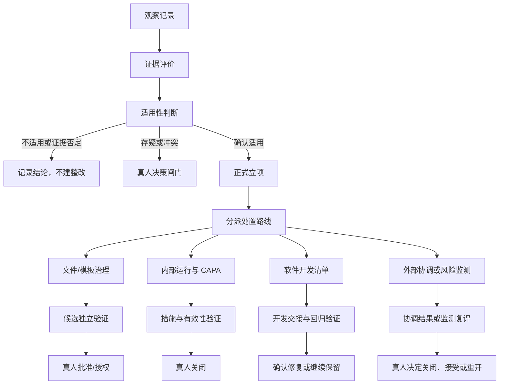

# LIMS-zhj 持续治理闭环设计 v0.3 完整复审意见

> 复审日期：2026-07-19  
> 复审对象：`/Users/lc.leixyz/Downloads/LIMSzhj持续治理闭环设计v0.3.md`  
> 对象版本：v0.3（2026-07-18）  
> 对象 SHA-256：`f3232eb45f7e5a2413c2a1ad1a0a2673deca0cb9fae49ddb6d3c48a1683dcdd3`  
> 复审性质：只读设计审查  
> 边界：未修改 v0.3 原文件，未修改现有 v1.19 技能，未写数据库，未发布或废止任何受控文件  
> 文件性质：设计审查意见，不是机构批准记录、CAPA 关闭记录或受控发布记录

---

## 1. 复审结论

### 1.1 总体结论

v0.3 已经可以作为持续治理闭环的**设计基线**接受，核心方向正确，不需要再次推倒重来。

已经成立的核心命题是：

> “自动一路改到底”的终点，是候选整改经过机器检查和独立验证，达到 `verified_candidate`；不是由模拟角色直接批准、生效或关闭正式 CAPA。

模拟质量负责人可以持续发现、立项、调度、退回和重开候选问题，也可以驱动体系文件、程序文件和记录模板的候选整改；但不能冒充真人签字，不能直接写生产数据库，不能执行正式发布，也不能替开发团队判定软件根因。

### 1.2 复审判定

当前建议状态：

**有条件通过设计复审，修订为 v0.3.1 后再进入技能改造实施计划。**

这里的“有条件通过”不是指体系或软件已经通过评审，而是指：

- 治理方向已经正确；
- 主要合规边界已经明确；
- 剩余问题集中在状态模型、证据字段和真实 LIMS 基线填实；
- 修正后可以进入工程化设计，不必再讨论根本方向。

### 1.3 当前最主要的问题

v0.3 剩余的核心缺陷，是将不同性质的问题都放入同一条 11 状态线性流程。

体系文件缺陷、人员能力问题、设备资源问题、实验室内部 CAPA、软件不好用事项和外部依赖问题，虽然可以共享“观察—举证—适用性—立项”主干，但不能全部经过 builder/compiler、受控文件批准和发布。

因此，v0.3.1 应从“单一状态链”改为：

> **公共治理主干 + 按处置出口分支的闭环状态机。**

---

## 2. 复审范围与依据

### 2.1 本轮复审范围

本轮重点检查：

1. “自动一路改到底”的终点是否明确；
2. 模拟质量负责人的权限是否足够、是否越过真人责任；
3. 适用性判断是否发生在正式立项之前；
4. 三轴问题模型能否支持多类问题分流；
5. 独立验证是否具备实际独立性；
6. 状态链是否覆盖批准、应用、生效和有效性确认；
7. 软件问题与内部 CAPA 的原因分析边界是否符合 ISO/IEC 17025；
8. LIMS 对接描述是否与现有契约、代码和 SQL 一致；
9. 文件废止、受控发布和正式关闭是否保留人工授权；
10. 该设计能否支撑后续持续、重复、可收敛的治理运行。

### 2.2 只读核对的项目文件

本轮核对了以下当前项目文件：

- `整合/接口契约-v1.0正版.md`
- `整合/技能套装/最新版/接口契约-v1.0正版.md`
- `jewelry-qms/app/service/QmsPreimportPackageService.php`
- `jewelry-qms/database/jewelry_qms.sql`
- `.team/当前战役.md`
- `.team/上下文.md`（历史归档，仅用于核对既有红线）

### 2.3 标准校准范围

本轮使用 ISO/IEC 17025:2017 / CNAS-CL01 对以下边界进行了校准：

- 7.11：数据和信息管理、LIMS 变更授权与验证；
- 8.2：管理体系文件及关联；
- 8.3：管理体系文件控制；
- 8.4：记录控制；
- 8.5：风险与机遇；
- 8.6：改进；
- 8.7：纠正措施；
- 8.8：内部审核；
- 8.9：管理评审。

本报告引用条款用于校准治理边界，不将项目建议冒充为标准原文或强制条款。

---

## 3. v0.3 已经可以定案的内容

### 3.1 自动治理终点

以下边界可以保留：

- 自动治理最远推进到 `verified_candidate`；
- `verified_candidate` 表示候选整改已经过机器检查和独立验证；
- 它不代表真人批准；
- 它不代表 LIMS 已正式应用；
- 它不代表文件已生效；
- 它不代表培训已真实完成；
- 它不代表 CAPA 已正式关闭；
- 它不代表真实运行有效性已经得到证明。

### 3.2 模拟质量负责人权限

以下权限设计合理：

- 读取治理证据和适用性依据；
- 建立、分级、合并、退回和重开候选问题；
- 调用 lab-qms-engineer 发起治理；
- 驱动程序文件修订候选和表格模板候选生成；
- 驳回缺乏逐字段溯源的整改；
- 推进候选问题至 `verified_candidate`；
- 将软件不好用事项写入开发清单。

以下禁止项也应继续保留：

- 不直接写生产数据库；
- 不直接执行正式 `--apply`；
- 不伪造人工复核；
- 不批准受控文件生效；
- 不正式关闭实验室 CAPA；
- 不替开发团队判断软件根因。

### 3.3 `apply-rehearsal` 的边界

v0.3 对 `apply-rehearsal` 的定位正确。

现有 `QmsPreimportPackageService::rehearseApply()` 明确要求：

- 显式提供人工已复核确认；
- 提供 review pack；
- 存在阻断发现时不能进入 `rehearsal_ready`；
- 不写数据库；
- 如果使用模拟评审包，只能证明命令链路可以演练，不能替代真实人工评审或用户授权。

因此：

- 人工批准前的自动治理主要使用 dry-run、结构校验、覆盖检查和隔离测试库验证；
- `apply-rehearsal` 用于人工复核后的应用路径演练；
- 正式 `--apply` 仍属于单独授权动作。

### 3.4 软件清单与内部 CAPA 的原因边界

v0.3 第 9 节方向正确：

- 给开发的软件清单只记录现象、复现条件、证据、影响和期望结果；
- 不把推测写成软件根因；
- 是否属于同一技术根因，由开发团队核对代码、配置和运行环境后确认；
- 实验室内部 CAPA 不能因为“不替开发归因”而删除原因评价；
- 进入纠正措施流程的内部不符合，应保留原因评价、再发生风险、措施实施和有效性验证证据。

这一边界符合 ISO/IEC 17025 第 8.7.1 至 8.7.3 条的要求。

需要注意：不是每一个普通更正都必须机械开展复杂“根因分析”。应根据不符合的性质和影响，评价是否需要采取纠正措施；一旦进入正式 CAPA，则应保留相应原因、措施和有效性记录。

### 3.5 振荡阈值

`N = 3` 可以作为项目治理规则定案。

它不是 ISO/IEC 17025 的强制数值，而是项目为了防止 AI 在“修改—复验—退回”之间无限振荡而设置的升级阈值。

高风险、适用性冲突、质量手册变化、体系结构变化、程序新增或废止等事项，不等待 3 轮，应立即进入真人闸门。

---

## 4. 需要在 v0.3.1 中修正的事项

> 下列风险等级表示“对本设计能否落地的影响”，不是对实验室开具的正式不符合等级。

| 编号 | 事项 | 设计影响 | 是否阻断实施 |
|---|---|---:|---|
| D-01 | 单一 11 状态链不能覆盖所有问题类型 | 高 | 是 |
| D-02 | 缺少“已批准/已授权”状态 | 高 | 是 |
| D-03 | 适用性画像未版本化 | 高 | 是 |
| D-04 | 三轴模型与主证据矩阵字段未对齐 | 高 | 是 |
| D-05 | 环境保真度证据不足以复现结论 | 中高 | 是 |
| D-06 | 独立验证角色只有名称，缺少运行隔离规则 | 中高 | 是 |
| D-07 | 完善度层级标题和含义冲突 | 高 | 是 |
| D-08 | LIMS 节仍错误地等待用户提供本机已有文件 | 中 | 否，但应本轮填实 |
| D-09 | “作废”措辞越过用户保留的废止拍板权 | 高 | 是 |
| D-10 | 契约标题“草案”与状态“正版”不一致 | 中 | 否，需登记受控修订 |

### 4.1 D-01：单一状态链应改为公共主干加分支

#### 当前问题

v0.3 第 6 节将所有正式候选问题统一放入以下路径：

`立项 → builder/compiler → 机器检查 → 独立验证 → 真人批准 → apply → 生效`

这条路径主要适用于体系文件、程序文件和记录模板，不适用于：

- 人员授权或培训问题；
- 设备、设施和环境问题；
- 实验室内部 CAPA；
- 软件代码或配置问题；
- 外部供应商或外部依据问题；
- 仅需真人决定是否适用的问题。

#### 修订建议

将状态模型分成公共主干和 4 条处置分支。

### 4.2 D-02：补充“已批准/已授权”状态

#### 当前问题

当前状态链从“待真人批准”直接跳到“已应用”，但状态说明又区分了 `approved` 和 `effective`。

这会产生两个问题：

1. 无法区分“批准了，但尚未执行 apply”和“已经应用”；
2. 审批责任与系统执行责任混在一起。

#### 修订建议

文件/模板治理路线采用：

`独立验证通过 → verified_candidate → 待批准 → 已批准/已授权 → 已应用 → 已生效 → 有效性确认`

权限分别为：

- `verified_candidate`：独立验证角色确认，engineer 记录；
- 待批准：系统自动进入；
- 已批准/已授权：真人授权批准人；
- 已应用：受权操作者或系统执行后，根据 apply 结果和审计记录进入；
- 已生效：按照机构文件控制规定完成生效、发放或启用；
- 有效性确认：通过真实记录、后续检查、内审或管理评审证明。

“已应用”不能由 AI 或真人仅凭文字声明推进，必须有执行结果。

### 4.3 D-03：适用性画像必须版本化

#### 当前问题

v0.3 已经把适用性判断前移，但没有规定画像的版本、有效期和变化后的重新评价。

如果机构范围、场所、检测活动、抽样职责、人员结构或外部依据发生变化，先前的“适用/不适用”结论可能失效。

#### 修订建议

适用性判断至少记录：

- `applicability_profile_id`
- `applicability_profile_version`
- `profile_hash`
- `effective_date`
- `applicability_basis`
- `decision_source`
- `confirmed_by`
- `confirmed_at`
- `reopen_trigger`

模拟质量负责人可以：

- 使用已经冻结、批准的画像执行规则判断；
- 对明确匹配的适用性规则自动形成候选判断；
- 发现画像冲突时停止自动立项。

模拟质量负责人不可以：

- 自行创造机构事实；
- 自行改变实验室活动范围；
- 自行决定新增或取消抽样、校准、分场所等重要适用性事实；
- 用模型推测替代机构确认。

画像升版后，应根据 `reopen_trigger` 自动筛出需要重新评价的既有发现。

### 4.4 D-04：三轴模型和主证据矩阵需要对齐

#### 当前问题

v0.3 规定每条发现具有：

1. 问题领域；
2. 证据等级；
3. 处置出口。

但主证据矩阵没有记录“问题领域”和“处置出口”，也缺少发现编号、当前状态、责任人和风险等级。

#### 三轴取值修订建议

##### 轴①：问题领域

建议改为 8 类，可多选：

1. 适用性与要求；
2. 体系文件、程序和记录模板；
3. 人员能力、授权和培训；
4. 资源、设备、设施和环境；
5. 技术活动与业务过程；
6. 运行实施与记录证据；
7. LIMS 配置、数据、权限和代码；
8. 外部依据、供应商和其他外部依赖。

增加“技术活动与业务过程”，用于承载方法选择与验证、抽样、样品处置、技术记录、结果报告等实际过程问题，避免把这些问题错误归入“运行证据”。

##### 轴②：证据/结论状态

建议把“证据等级”改名为“证据与结论状态”，使用：

- `unverified`：未经核实；
- `provisional`：候选判断；
- `needs_equivalent_stack`：需要等价环境复验；
- `confirmed`：已确认；
- `disconfirmed`：证据否定；
- `not_applicable`：经适用性判断不适用。

“沙箱噪声”宜作为环境或结论标签，不宜与“已确认”并列为同一种证据等级。

##### 轴③：处置路线

建议改为可多选：

- 真人适用性或批准决策；
- builder/compiler 文件候选整改；
- 实验室运行整改或 CAPA；
- 培训、授权与能力处理；
- LIMS 配置或基础设施处理；
- 软件开发团队清单；
- 外部供应商、监管或其他外部协调；
- 接受风险、继续监测或无需整改。

“真人决策”本质上既可能是处置路线，也可能是其他路线中的闸门。数据结构中应把：

- `action_route`
- `human_gate`

分成两个字段，避免混淆。

### 4.5 D-05：环境保真度需要形成可复验证据

#### 当前问题

“同为 MySQL、同 schema”不足以证明环境等价。

同一数据库引擎和结构下，以下差异仍可能改变结论：

- 代码版本不同；
- 数据库迁移集合不同；
- 配置、权限和功能开关不同；
- 数据库小版本或 SQL mode 不同；
- 种子数据和业务状态不同；
- 外部服务或文件挂载不同；
- 运行镜像不同。

#### 修订建议

每条软件或 LIMS 结论至少记录：

- `code_commit_sha`
- `release_or_branch`
- `container_image_digest`（如适用）
- `migration_set_or_schema_hash`
- `database_engine_version`
- `configuration_profile`
- `permission_profile`
- `fixture_or_data_class`
- `contract_version`
- `reproduction_command_or_steps`
- `evidence_artifact`

第一原则宜修订为：

> 结论强度不得超过环境保真度和证据强度；环境保真度必须由可复验的环境指纹证明，不能只用“与生产相同”作口头描述。

不得复制生产敏感数据来证明保真度。可以使用同结构、同迁移、同配置类别和脱敏/合成测试数据建立独立验收环境。

### 4.6 D-06：独立验证需要运行隔离，而不只是角色名称不同

#### 当前问题

如果“整改者”和“独立验证者”只是两个提示词角色，但共享同一整改上下文、可以继续修改候选，就不能充分证明验证独立。

#### 修订建议

独立验证角色应满足：

- 使用独立会话或隔离上下文；
- 只接收冻结的整改候选、要求依据和验收标准；
- 不接收整改者的隐含推理；
- 对候选文件只读；
- 无权调用 builder/compiler 修改正在验证的对象；
- 使用固定测试集和反向场景；
- 输出通过、退回或证据不足；
- 失败时只退回 engineer，不就地替整改者修复；
- 验证记录写入主证据矩阵。

同一个底层模型可以在技术上承担不同角色实例，但不能让同一角色实例在同一轮中既修改又最终验证自己的修改。

高风险事项、手册或结构变化、适用性冲突和正式批准仍需真人。

### 4.7 D-07：完善度层级应改为 5 层

#### 当前问题

v0.3 第 6 节标题写“三层达标”，第 7 节实际列出 4 层。

第③层标题写“批准/分发/培训准备完成”，解释却是“真人批准、受控分发、培训到位”；随后又说前三层只能表示候选发布条件。三处语义相互冲突。

#### 修订建议

| 层级 | 名称 | 达标含义 | 可以宣称什么 |
|---|---|---|---|
| L1 | 内容候选完整 | 文件、程序、记录模板候选完成并通过内容机检 | 候选内容完整 |
| L2 | LIMS 技术验证通过 | 数据结构、dry-run、隔离导入或功能验证通过 | 技术上具备对接条件 |
| L3 | 实施准备完备 | 审批材料、发布方案、培训包、回退方案准备完成 | 具备提交批准和实施的条件 |
| L4 | 已批准并实施 | 真人批准，已应用、发放、培训或启用 | 已实施/已生效 |
| L5 | 运行有效性确认 | 真实运行记录、复验、内审或管理评审证明有效 | 实际闭环 |

总体完善度取最低层级，不取平均值。

只有 L5 可以称为“体系治理实际闭环”。L1 至 L3 只能称为候选或实施准备状态，L4 只能称为已实施，不能提前代替有效性结论。

### 4.8 D-08：LIMS 节不再等待用户上传文件

v0.3 第 10、14 节写明仍需用户提供《接口契约 v1.0 正版》和 `jewelry_qms.sql`，但这两份文件当前项目已经存在，本轮已只读核对。

v0.3.1 应删除“上传或桌面端连接后补实”的表述，直接填写当前项目事实，见本报告第 8 节。

### 4.9 D-09：废止必须保留真人拍板

v0.3 第 12 节写明旧字段映射“待确认废止”，但第 13 节又直接写“对接方案 v0.1 作废”。

这两处不一致。

根据用户已经明确的拍板边界：

- 外部文件纳入需用户拍板；
- 质量手册和结构变化需用户拍板；
- 程序新增或不适用废止需用户拍板；
- 已产出文件的正式废止也不能由设计稿或模拟角色直接完成。

建议统一改为：

> 对接方案 v0.1 标记为“拟被 v0.3.1 后续方案替代，待用户批准后废止”；在批准前保留历史引用和替代关系，不直接删除。

### 4.10 D-10：契约文件存在标题状态不一致

当前两份契约副本：

- `整合/接口契约-v1.0正版.md`
- `整合/技能套装/最新版/接口契约-v1.0正版.md`

本轮 SHA-256 核对结果相同：

`c32b9bfd41e8a9e8eaef9d51d0e84907ac62d1fdd66081b12d448e6a9c906de5`

但契约正文标题仍为“v1.0（草案）”，状态段和文件名写“v1.0 正版”。

这属于当前版本识别不一致，应登记为文件控制修订项。后续应按授权流程修正标题，不在本轮直接改动。

---

## 5. 建议采用的状态模型

### 5.1 公共治理主干

所有观察共享以下主干：

| 状态 | 进入条件 | 推进者 | 退出结果 |
|---|---|---|---|
| `observed` | 排演或运行发现现象 | 排演角色/运行人员 | 进入证据评价 |
| `evidence_assessed` | 证据、复现条件和环境信息已整理 | 排演角色/验证角色 | 确认、候选、待复验或否定 |
| `applicability_checked` | 已按冻结画像判断适用性 | 模拟质量负责人或真人 | 适用、不适用、冲突 |
| `finding_accepted` | 适用且证据足以立项 | 模拟质量负责人 | 建立正式候选问题 |
| `route_assigned` | 已确定处置路线、责任人和闸门 | lab-qms-engineer | 进入对应分支 |

若证据否定或不适用，应记录结论和依据，不建立虚假整改。

若适用性冲突，应停在真人闸门，不自动进入整改。

### 5.2 文件、程序和记录模板治理分支

`candidate_generated → machine_checked → independent_verified → verified_candidate → pending_human_approval → approved_authorized → applied → effective → effectiveness_confirmed`

适用对象：

- 程序文件修订；
- 记录模板新增或修订候选；
- 体系文件内容修订候选；
- LIMS 结构化预导入候选。

注意：

- 质量手册、结构变化、程序新增或废止，在生成候选后仍必须停在用户拍板闸门；
- 普通程序修订和表格模板可以自动完成候选治理，但正式生效仍应符合机构文件控制和授权要求。

### 5.3 实验室运行整改与 CAPA 分支

`controlled_or_corrected → cause_need_evaluated → causes_recorded_if_needed → action_planned → action_implemented → effectiveness_verified → pending_human_closure → human_closed`

适用对象：

- 实际运行不符合；
- 重复发生或影响较大的记录缺失；
- 能力、授权和培训问题；
- 资源、设备、环境或技术活动问题；
- 经评价需要采取纠正措施的事项。

### 5.4 软件开发清单分支

`evidence_packaged → ready_for_developer_handoff → developer_acknowledged → fix_build_received → regression_tested → confirmed_fixed_or_retained`

清单不要求 AI 推断软件根因，但应保留：

- 现象；
- 环境指纹；
- 复现步骤；
- 证据；
- 影响；
- 期望结果；
- 收到的修复版本；
- 回归结果。

如果问题阻断实验室活动，实验室侧仍需单独评价风险、临时控制和是否形成内部 CAPA。

### 5.5 外部协调和风险监测分支

`external_action_requested → response_pending → response_received → risk_reassessed → accepted_monitored_or_reopened`

适用对象：

- 外部标准或依据待确认；
- 外部供应商事项；
- 开发团队暂不处理但实验室可暂时控制的事项；
- 当前证据不足，需要观察运行数据的事项。

---

## 6. 建议的角色与权限矩阵

| 角色 | 发现/举证 | 立项/分流 | 修改候选 | 独立验证 | 真人批准 | 正式 apply | CAPA 正式关闭 |
|---|---|---|---|---|---|---|---|
| 排演角色 | 允许 | 建议，不最终决定 | 禁止 | 可参与取证，不作最终验证 | 禁止 | 禁止 | 禁止 |
| 模拟质量负责人 | 允许 | 允许 | 不直接编辑，调用 engineer | 不验证自身调度结果 | 禁止 | 禁止 | 禁止 |
| lab-qms-engineer | 允许 | 允许编排 | 调用整改引擎 | 不作最终独立验证 | 禁止 | 禁止 | 禁止 |
| builder/compiler | 读取必要证据 | 禁止改分流决定 | 允许生成候选 | 禁止验证自己的候选 | 禁止 | 禁止 | 禁止 |
| 独立验证角色 | 可补充证据 | 可建议重分流 | 禁止修改被验证候选 | 允许 | 禁止 | 禁止 | 禁止 |
| 真人授权批准人 | 允许 | 允许 | 可要求修订 | 可采信或要求复验 | 允许 | 可授权 | 按职责允许 |
| 受权操作者/系统 | 禁止自行立项 | 禁止 | 仅执行已授权动作 | 记录执行结果 | 禁止 | 条件允许 | 禁止 |
| 开发团队 | 接收软件证据 | 处理开发内部分类 | 修改软件 | 提供开发验证证据 | 不批准实验室受控文件 | 不执行实验室正式 apply | 禁止 |

补充规则：

- “真人授权批准人”应按机构真实职责矩阵确定，不应假定所有事项都由同一个质量负责人批准；
- 质量负责人、技术负责人、文控、设备负责人和授权签字人的职责可能不同；
- 模拟角色不能因为名称中带“质量负责人”而自动继承真人法律或组织授权。

---

## 7. 主证据矩阵建议字段

主证据矩阵应成为持续治理闭环的单一事实源。建议至少包含以下字段组。

### 7.1 身份与版本

- `finding_id`
- `finding_title`
- `baseline_version`
- `baseline_hash`
- `created_at`
- `current_state`
- `current_round`
- `parent_finding_id`

### 7.2 三轴与风险

- `problem_domains`
- `evidence_conclusion_status`
- `action_routes`
- `human_gate`
- `severity`
- `impact_scope`
- `risk_statement`

### 7.3 要求与适用性

- `requirement_source`
- `clause_or_requirement`
- `applicability_profile_id`
- `applicability_profile_version`
- `applicability_basis`
- `applicability_result`
- `applicability_confirmed_by`
- `applicability_confirmed_at`

### 7.4 发现证据

- `observation`
- `reproduction_steps`
- `evidence_references`
- `environment_fidelity`
- `environment_fingerprint`
- `evidence_collected_by`
- `evidence_collected_at`

### 7.5 整改候选

- `candidate_change_id`
- `candidate_version`
- `candidate_hash`
- `changed_objects`
- `field_traceability`
- `change_reason`
- `owner`

### 7.6 机器检查与独立验证

- `machine_check_suite`
- `machine_check_result`
- `machine_check_evidence`
- `independent_verifier`
- `independent_verification_result`
- `independent_verification_evidence`
- `verification_at`

### 7.7 真人闸门与实施

- `approval_status`
- `approved_by`
- `approved_at`
- `authorization_reference`
- `apply_status`
- `apply_result_reference`
- `effective_status`
- `effective_at`
- `distribution_or_training_reference`

### 7.8 有效性与重新开启

- `effectiveness_criteria`
- `operating_evidence`
- `effectiveness_result`
- `effectiveness_confirmed_by`
- `effectiveness_confirmed_at`
- `reopen_conditions`
- `reopened_at`
- `reopen_reason`

主矩阵应允许某些字段按处置路线标记为 `not_applicable`，但不能静默留空。这样既保留统一总览，也不会强迫软件问题经过文件发布字段。

---

## 8. 已核实的 LIMS 对接事实

### 8.1 当前预导入包

项目当前契约和服务代码均要求：

**6 份必需 CSV + 1 份 `preimport_manifest.json`。**

6 份 CSV 为：

1. `documents_preimport.csv`
2. `structured_documents_preimport.csv`
3. `record_form_templates_preimport.csv`
4. `traceability_matrix_preimport.csv`
5. `manual_blocks_preimport.csv`
6. `external_sources_preimport.csv`

可选存在：

- `draft_snapshot/`
- 人工评审包；
- 字段目录包；
- 发布演练包；
- 培训实施包；
- 第二阶段复核包；
- 治理关闭和治理刷新等子包。

### 8.2 manifest 主要要求

契约规定 manifest 至少承载：

- `package_type`
- `suite_version`
- `contract_version`
- `package_version`
- 6 类数据的 `counts`
- `semantic_signatures`
- `machine_check_summary`
- `facts_hash`
- `guardrails`

当前代码对 counts 和应用闸门实施校验；语义签字不完整会阻断 apply/apply-rehearsal，dry-run 保持对旧包的兼容边界。

### 8.3 6 份 CSV 的当前关键列

#### `documents_preimport.csv`

- `doc_number`
- `action`
- `title`
- `document_type`
- `version`
- `owner_position`
- `scope`

#### `record_form_templates_preimport.csv`

- `doc_number`
- `name`
- `module`
- `field_schema_json`

`field_schema_json` 必须为合法 JSON 数组，并包含当前代码要求的 7 个键：

- `record_number`
- `record_name`
- `applicable_clause`
- `related_procedure`
- `responsible_position`
- `trigger_time`
- `correction_rule`

#### `traceability_matrix_preimport.csv`

- `clause`
- `element`
- `source_clause`
- `human_review_required`
- `relation_confidence`

#### `manual_blocks_preimport.csv`

- `stable_key`
- `doc_number`
- `block_type`
- `link_confidence`

#### `structured_documents_preimport.csv`

- `doc_number`
- `title`
- `document_role`
- `version`
- `markdown_path`

#### `external_sources_preimport.csv`

- `source_code`
- `name`
- `version`
- `status`
- `freshness_status`

### 8.4 当前结构化关系链

数据库当前存在以下主链：

`qms_document_assets → qms_structured_documents → qms_document_blocks → qms_document_block_links`

主要作用分别是：

- `qms_document_assets`：记录来源资产、归档状态、路径、哈希和结构化/发布状态；
- `qms_structured_documents`：记录结构化文档主体、角色、编号、版本和状态；
- `qms_document_blocks`：记录稳定块、章节、块类型、正文和顺序；
- `qms_document_block_links`：记录块与条款、要素、程序、记录模板、岗位和业务模块之间的关系。

这条链应作为后续 LIMS 对接的真实基线，不再使用未经当前代码和 SQL 核对的旧字段推断。

### 8.5 事实源移交边界

现有契约规定：

- 构建期以套装治理台账为事实源；
- `--apply-rehearsal` 不发生事实源移交；
- 正式 `--apply` 成功后，平台数据库成为运行期事实源；
- 底稿后续修改不会自动改变运行平台，必须重新形成候选包并过闸。

持续治理设计应继承这一边界。

---

## 9. ISO/IEC 17025 边界校准

### 9.1 文件控制

依据第 8.3.2 条，管理体系文件应在发布前得到批准，并控制版本、变更、可获得性和过时文件误用。

因此：

- AI 可以起草和验证候选；
- AI 不应冒充授权批准人；
- 文件正式生效和废止必须按机构文件控制执行；
- “候选可发布”与“已经发布”必须是不同状态。

### 9.2 记录控制

依据第 8.4 条，治理闭环本身也应留下可识别、可检索、受保护的记录。

主证据矩阵不能只作为临时报告，应明确：

- 保存位置；
- 访问权限；
- 版本和修改记录；
- 备份；
- 保留期限；
- 重新开启历史。

### 9.3 LIMS 变更与验证

依据第 7.11 条，LIMS 及其变更应受授权、文件化并经过适当验证。

因此：

- dry-run 通过不等于正式批准；
- 沙箱演练不等于真实运行有效；
- apply 应保留授权和执行证据；
- 版本、迁移、配置和验证环境应可追溯；
- 变更后的回归验证应与影响范围相匹配。

### 9.4 纠正措施

依据第 8.7 条：

- 发生不符合后应控制和纠正；
- 应评价是否需要消除原因；
- 采取的措施应与影响相匹配；
- 应评价措施有效性；
- 应保留不符合、原因、措施和结果记录。

因此，“软件清单不替开发归因”不能被扩大解释为“实验室 CAPA 不需要原因评价”。

### 9.5 内审与管理评审

内部审核和管理评审是运行有效性的重要证据来源，但不是每一项候选整改都必须等待下一次完整内审才能进入发布准备。

可按风险采用：

- 代表性试填；
- 反向排演；
- 运行记录抽查；
- 专项复验；
- 后续内审；
- 管理评审输入和输出。

不同证据对应不同成熟度，不能把候选验证写成真实运行有效性。

---

## 10. v0.3.1 建议修改清单

建议在 v0.3 基础上形成 v0.3.1，不覆盖原文件。

### 10.1 必改

- 将单一 11 状态链改为公共主干加 4 条处置分支；
- 增加“已批准/已授权”状态；
- 将 `verified_candidate` 与“待真人批准”拆开；
- 适用性画像增加版本、哈希、生效时间和重新开启规则；
- 三轴模型增加技术活动/业务过程领域；
- 将证据等级改为证据与结论状态；
- 将处置路线和真人闸门拆成两个字段；
- 主证据矩阵补齐三轴、当前状态、责任人、风险和环境指纹；
- 明确独立验证的会话隔离、只读和无整改权限；
- 完善度改为 L1 至 L5；
- 删除“等待用户上传契约和 SQL”的表述，填入本轮核实事实；
- 将“作废”改为“拟替代、待批准后废止”。

### 10.2 宜改

- 将“版本锁定、同 schema”扩展为完整环境指纹；
- 将“关闭—重开”改成“候选退回/重开”，避免模拟角色被理解为正式关闭 CAPA；
- 正式批准角色改称“真人授权批准人/责任人”，不假定全部事项只能由质量负责人签署；
- 为每条路线规定 `not_applicable` 字段规则；
- 给每轮治理变更集设置范围或影响分析，避免一次自动修改过多文件；
- 将 v0.3.1 日期更新为实际修订日期。

### 10.3 另行登记

- 接口契约标题“草案”与状态“正版”不一致；
- 契约副本虽哈希一致，仍需明确单一现行入口；
- 历史对接方案的替代、保留和废止需要用户授权；
- 技能包属于内部 AI 治理资产，不转交开发团队。

---

## 11. 进入技能改造前的验收条件

v0.3.1 至少满足以下条件后，才建议修改 v1.19 技能或治理 playbook：

- [ ] 公共主干和各分支状态完整；
- [ ] `verified_candidate`、批准、应用、生效、有效性确认完全分离；
- [ ] 模拟角色权限和真人权限不存在重叠冒充；
- [ ] 适用性画像有版本和重新开启规则；
- [ ] 三轴模型和主证据矩阵字段完全对应；
- [ ] 软件清单和内部 CAPA 原因边界明确；
- [ ] 独立验证角色具备运行隔离；
- [ ] LIMS 契约、代码和 SQL 字段已经填实；
- [ ] `apply-rehearsal` 和正式 apply 的人工闸门保持；
- [ ] 质量手册、结构变化、程序新增或废止继续保留用户拍板；
- [ ] 旧文件只标记拟替代，不自动废止；
- [ ] 候选治理测试不被表述为真实批准、培训、发布或生产写入。

---

## 12. 建议的后续落地顺序

### 第 1 步：形成 v0.3.1 设计稿

只修改规则和状态模型，不修改技能、不写数据库。

### 第 2 步：建立主证据矩阵样例

使用少量已知问题分别试填：

- 体系文件或记录模板缺口；
- 内部 CAPA 场景；
- 软件不好用事项；
- 适用性存疑事项。

验证同一矩阵能否支持不同分支，而不会出现大量含义不明的空字段。

### 第 3 步：建立治理角色卡

角色卡应明确：

- 可读对象；
- 可写对象；
- 可调用的技能；
- 禁止动作；
- 状态推进权限；
- 交接对象；
- 失败和升级条件。

先形成治理角色卡，不直接复用培训角色卡。

### 第 4 步：增量修改 lab-qms-engineer

由 lab-qms-engineer 编排：

- 排演；
- 分流；
- builder/compiler 候选整改；
- 独立验证；
- 防振荡；
- 真人闸门；
- 主证据矩阵更新。

### 第 5 步：接入 rehearsal-testing

rehearsal-testing 只承担：

- 多角色排演；
- 发现和证据整理；
- 复验；
- 覆盖核对；
- 软件清单生成；
- 运行结果反馈。

它不负责批准受控文件，也不正式关闭 CAPA。

### 第 6 步：选择低风险试点

优先选择：

- 适用性已经确认；
- 有明确程序条款依据；
- 不涉及质量手册和结构变化；
- 不涉及程序新增或废止；
- 可以逐字段溯源；
- 能在隔离环境完成验证；
- 不需要写生产数据库。

例如普通程序修订候选或记录模板修订候选。

### 第 7 步：真人验收后再扩大范围

首个试点应重点验证：

- 模拟质量负责人能否正确分流；
- builder/compiler 是否严格按依据整改；
- 独立验证能否发现整改偏差；
- 3 轮振荡规则能否触发；
- 主证据矩阵是否完整；
- `verified_candidate` 是否在真人批准前停止。

---

## 13. 最终意见

v0.3 已经证明“模拟质量负责人持续运行、发现问题后驱动对应技能整改、再排演验证”的总体设想是可行的。

这套机制真正能够自动闭合的部分是：

- 体系文件和记录模板候选治理；
- 证据充分且适用性明确的问题分流；
- 机器检查；
- 独立候选验证；
- 防振荡和升级；
- 软件问题证据化并进入开发清单。

不能由模拟角色自动替代的部分是：

- 机构事实和适用性重大决策；
- 外部文件正式纳入；
- 质量手册和体系结构变化；
- 程序新增或废止；
- 受控文件正式批准和生效；
- 正式生产 apply；
- 实验室 CAPA 正式关闭；
- 真实运行有效性确认。

因此，推荐的最终治理原则为：

> **AI 自动治理候选，真人承担组织责任；机器证明候选符合规则，运行证据证明整改真正有效。**

完成本报告列出的 v0.3.1 修订后，可进入技能改造实施计划，不再需要第三轮方向性推翻。
