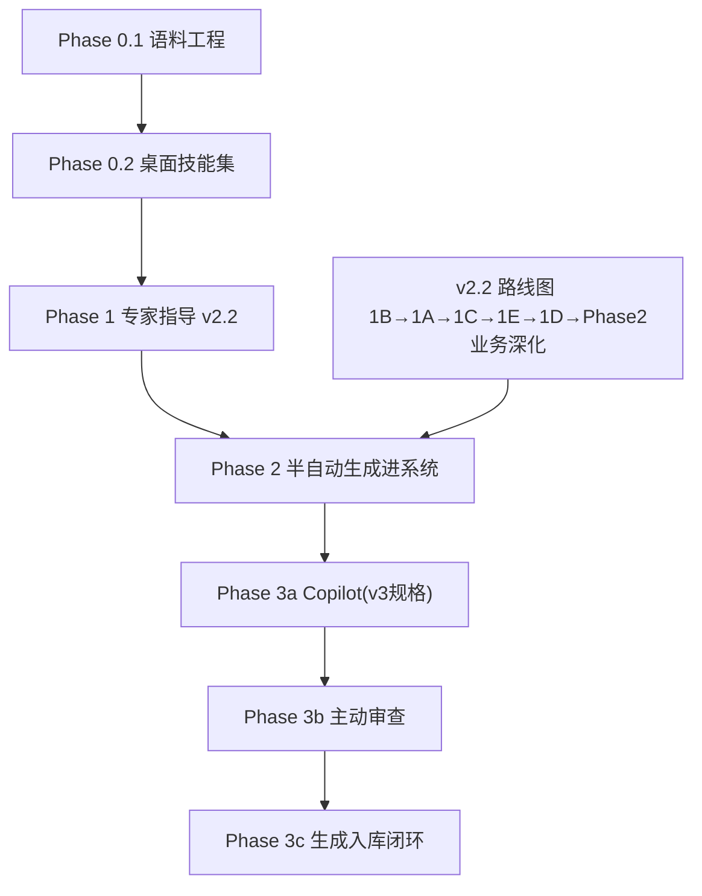

# 实验室 QMS 专家智能体路线图（计划版）

## 背景与目标

- 服务对象：本珠宝检测实验室（单实验室，CMA/CNAS 建体系与迎评审）。
- 专家双角色：
  1. **开发期「体系建设军师」**：拆解需求，指导构建半自动 QMS 生成管理系统（jewelry-qms 仍为主交付物）；
  2. **运行期「驻场专家」**：长期内嵌 jewelry-qms，提供合规意见与半自动生成能力。
- 实现范式参考 [wxlawyers/lawyer-knowledge-graph](https://github.com/wxlawyers/lawyer-knowledge-graph)：技能集（SKILL.md 自然语言工作流）+ 知识库（Markdown 卡片）+ 工具集成，低代码、可迭代。
- 既有资产：
  - `~/.agents/skills/iso-17025-zh`：中文 17025 专家技能（含差距分析模板、审核检查表、方法确认指南、标准结构 4 个参考件）——专家雏形；
  - `现用文件/`：质量手册（第四版）、程序文件、记录表格、作业指导书——内部语料原料；
  - `docs/AI_CHAT_ASSISTANT_SPEC.md` v3：QMS Copilot 规格（问答 + 表单草稿，AI 只建议人确认）——Phase 3a 蓝图；
  - `docs/QMS_V2_2_ROADMAP.md`：系统开发主线（11 个 Phase，**文档标注全部 pending，但代码状态见下节校准**）。

## 当前实现状态校准（2026-07 代码核查）

v2.2 路线图的 todos 状态与仓库代码**不同步**，规划与验收时区分三档：

| 档位 | 证据 | 处理 |
|------|------|------|
| 文档 pending / 代码已部分落地 | `CheckReminders`（对应 Phase 1B）、`ComplianceAssess` + `ComplianceCheckService`、`FieldAuditService`（对应 Phase 1E）、AiChat 全家桶（`AiChat/AiChatService/CopilotReadService/PageContextBuilder/DeepSeekService`，对应 Copilot v3）、`CurrentFilesSeed`/`QmsDocumentStructureService`（现用文件结构化链路）、`RecordFormRebuildSchema` 系列命令、T2.7 `qms_external_change_events` + `PlanningChangeEvent`（Docker/PHP smoke 已通过，仍需后续人工页面验收）、T0.1 `knowledge/` 骨架、T0.4 `qms:seed-current-files --enumerate-procedures` 枚举清单（42/38/4 基线）与 `--export-knowledge-internal` 单向导出（当前 1 份手册 + 37 份程序；`.doc` fallback 已补，`05-02` 编号附件/表单列为报告待复核项） | 对应 Phase **开工前先做状态验收**：核对已实现范围 vs 路线图验收标准，只补差量 |
| 需验收确认 | 上述已落地代码是否满足各自验收标准未经核查 | 纳入各任务卡首步 |
| 真 pending | 多场所（1C）、CSRF（1D）等未见实现痕迹 | 按路线图执行 |

## 规范依据基线

- **CNAS**：`CNAS-CL01:2018`（等同 17025:2017）+ `CNAS-CL01-G001` + `CNAS-CL01-A015:2018`（珠宝玉石、贵金属检测领域应用说明）。
- **CMA**：2023 版《检验检测机构资质认定评审准则》为主依据。
- **`RB/T 214-2017` 已于 2024-11-26 废止**，仅作历史沿革参考，全部文档与技能中不得作为现行依据引用。

## 总体架构：一套知识资产，两个运行时

```text
knowledge/                      # 单一事实源，入 Git 受控
├── standards/                  # ISO 17025 条款卡片、CNAS-CL01/G001/A015、CMA 2023 评审准则、CNAS-GL、珠宝 GB/T
├── internal/                   # 本所体系文件结构化 Markdown（带 17025 条款映射）
└── cases/                      # 评审案例卡片（少量起步，运行中持续沉淀）
        │
        ├─→ 运行时 A：桌面专家技能集（Claude Code / Cowork）——开发期军师
        └─→ 运行时 B：QMS Copilot（jewelry-qms 内嵌）——运行期驻场，知识层打包为 RAG 语料
```

设计约束：

1. 知识只维护一份，两个运行时消费同一目录；
2. 所有专家结论**必须引用条款号**（17025 / CNAS-CL01 / CMA 2023 评审准则），不可追溯的建议视为不合格输出；
3. AI 生成的任何体系文件，必须经 8.3 文件控制审批流后才成为受控文件；
4. 智能体权限分级上线，每级以上一级稳定运行为前提。

## 阶段依赖



推进原则：**专家先行**——Phase 0 不写系统代码、成本低，先建好再用它加速 v2.2；v2.2 主线不因专家线停摆。

---

## Phase 0：桌面专家扩建（专家先行）

### 0.1 语料工程（工作量大头）

| 任务 | 说明 | 验收标准 |
|------|------|----------|
| 标准卡片库 | 17025 逐条款拆为卡片（条款号、原文要点、shall/should 区分、常见不符合项、所需证据）；CNAS-CL01/G001/A015 附加要求与 CMA 2023 评审准则差异点单列（RB/T 214-2017 已废止，仅入沿革字段） | 任一条款号可在 `knowledge/standards/` 检索到独立卡片；4–8 章全覆盖 |
| 内部文件结构化 | `现用文件/` docx → Markdown：质量手册按章节、程序文件按文件、每份标注对应 17025 条款 | 每份程序文件有条款映射表；与 docx 原文逐段可对照，无内容丢失 |
| 案例库初始化 | 建 `knowledge/cases/` 目录规范与卡片模板（场景、条款、不符合描述、整改、教训）；录入现有零散经验 | 模板定稿；首批 ≥5 张卡片 |

### 0.2 技能集拆扩（对标律师项目 34 技能的组织方式）

| 技能 | 用途 | 服务阶段 |
|------|------|----------|
| qms-dev-advisor | 拆解 v2.2 需求，审查功能设计对 7.11（数据管理）、8.3（文件控制）等条款的满足度 | 开发期核心 |
| qms-gap-analysis | 差距分析（升级现有 gap-analysis-template） | 通用 |
| qms-doc-drafting | 程序文件/作业指导书/手册章节起草（结构：目的范围→引用条款→职责→程序→记录→相关文件） | Phase 2 生成能力原型 |
| qms-record-schema | 从程序文件推导记录表格 schema，衔接现有记录表格实例机制 | Phase 2 生成能力原型 |
| qms-audit-prep | 内审/迎评 checklist 生成（升级现有 audit-checklist） | 运行期 |
| qms-capa | 不符合项分析→原因→纠正措施建议→有效性验证要点 | 运行期 |
| knowledge-accumulation | 评审/运行经验沉淀为案例卡片，回链条款号 | 持续 |

验收标准：每个技能有独立 SKILL.md；用真实场景各跑通 1 次并人工核对条款引用准确性；`iso-17025-zh` 保留为总入口，引用 `knowledge/`。

---

## Phase 1：专家指导 v2.2 开发

- v2.2 按既定顺序推进：1B→1A→1C→1E→1D→Phase 2 业务深化→Phase 3→Phase 4。
- 工作方式：每个 v2.2 Phase 开工前，qms-dev-advisor 出**条款对标需求说明**（本功能满足哪些条款、评审时查什么证据、验收标准补充）；完工后做**合规审查**（对照说明逐项核查）。
- 本阶段同时是桌面技能的实战打磨期 = 产品化前验证期。
- 验收标准：v2.2 每个已完成 Phase 均有对应的需求说明与审查记录（存 `docs/` 或知识库）。

## Phase 2：半自动生成能力进系统

前置：Phase 1 中对应技能已被实战验证；v2.2 Phase 2.x 业务模块基本就位。

| 能力 | 实现思路 | 验收标准 |
|------|----------|----------|
| 体系文件生成 | 复用已有 AI 文档助理管线反向操作：AI 起草→人审→结构化入库；提示词/知识来自 qms-doc-drafting | 生成一份程序文件草稿，经人审修改率可接受，走审批流入库 |
| 记录表格生成 | qms-record-schema 产品化：程序文件→记录表格 schema→记录表格实例 | 从任一程序文件推导出可用表格 schema，字段与条款证据要求对应 |
| 运行记录预填 | 内审计划/checklist、期间核查计划、管评输入等由 AI 预填草稿（沿用 v3「只填草稿不保存」原则） | 草稿仅填充不写库；用户确认保存 |
| 缺口→整改任务 | 对标 17025 扫描体系现状，差距清单→自动生成整改任务并分配（对接 CAPA/任务模块） | 差距项可一键转任务，任务回链条款号 |

## Phase 3：内嵌专家智能体分级上线

| 级别 | 能力 | 前提 |
|------|------|------|
| 3a | QMS Copilot 按 v3 规格：问答 + 表单 DOM 草稿，只建议不写库 | v3 规格已定，v2.2 基础设施（校验、CSRF）就位 |
| 3b | 主动审查：定时/触发式扫描体系文件与记录，出具合规审查报告 | 3a 稳定；知识层打包为 RAG 语料的同步机制建立 |
| 3c | 生成→审批→发布入库闭环：AI 生成文件经审批流后直接成为受控文件 | 3b 稳定；8.3 审批流与字段级审计（v2.2 Phase 1E）就绪 |

知识同步机制：`knowledge/` 为源，构建脚本打包为 Copilot 的检索语料；案例卡片经 knowledge-accumulation 技能双向回流。

---

## 开放决策（默认值，待确认）

1. **知识库位置**：默认 `LIMS-zhj/knowledge/`（Git 受控、两运行时共享）；`~/.agents/skills/` 只留技能薄壳引用。
2. **保密边界**：v3 规格使用 DeepSeek API。体系文件喂外部 API 前需明确可接受范围；否则 Phase 3 预留本地模型选项。
3. **标准文本版权**：17025/GB 标准原文有版权，知识卡片以「条款号 + 要点复述 + 合规要求解读」形式组织，不整篇收录原文。

## 风险

- docx→Markdown 结构化质量决定专家上限，Phase 0.1 需人工抽检；
- 专家线与 v2.2 主线争夺精力：Phase 0 严格限定不写系统代码，防止范围蔓延；
- AI 条款引用幻觉：技能层强制「先查 `knowledge/standards/` 再作答」，无卡片支持的条款引用需标注待核。

## 相关文档

- [CHANGE_PIPELINE_FEASIBILITY.md](CHANGE_PIPELINE_FEASIBILITY.md) — 外部规范变更→文件链路的可行性论证与五层方案
- [EXPERT_AGENT_TASKS.md](EXPERT_AGENT_TASKS.md) — Codex 评审/执行任务单
- [QMS_V2_2_ROADMAP.md](QMS_V2_2_ROADMAP.md) — 系统开发主线
- [AI_CHAT_ASSISTANT_SPEC.md](AI_CHAT_ASSISTANT_SPEC.md) — Phase 3a 蓝图
- [QMS_TRACEABILITY_DATA_MODEL.md](QMS_TRACEABILITY_DATA_MODEL.md) — 条款追溯数据模型
- `~/.agents/skills/iso-17025-zh/` — 现有专家技能（Phase 0.2 拆扩基础）
