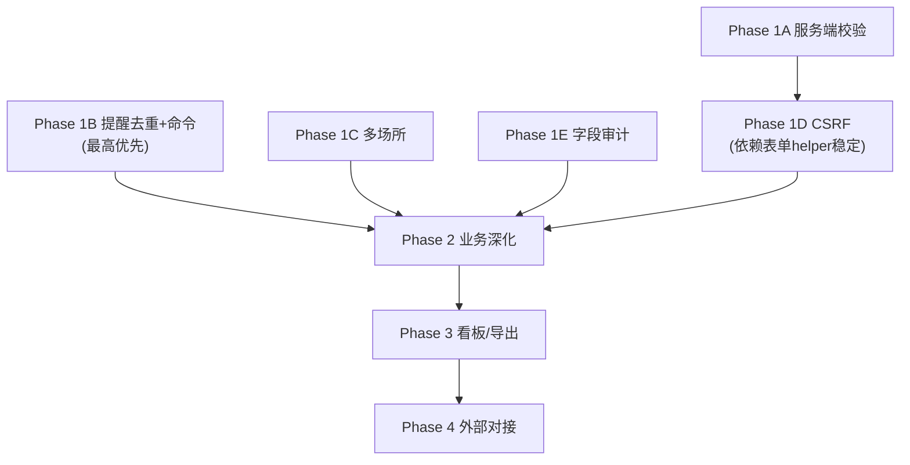

# Jewelry QMS v2.2 开发计划（执行版）

## 背景与约束

- 单实验室（1主+N分场所），本地私有化部署，体系文件统一管理
- 设备偶尔跨场所调拨，人员部分固定/部分流动
- **核心目标：为 CMA/CNAS 认证评审建立完整的信息化质量体系记录**
- 当前版本 v2.1.0，已完成 P0-P2（文件控制、九模块、体系策划中心）
- 无明确上线时间压力，按质量推进

## 执行原则

1. **每个子阶段独立 PR**，独立可合并、可回滚
2. **附件统一复用 `file_uploads` 表**（`jewelry-qms/database/jewelry_qms.sql`），不在各模块新增 `*_file_path/name` 字段
3. **运行证据优先通过记录表格实例承载**（期间核查、监督记录、证书复核等），仅在需要结构化查询/统计时才新增专表
4. **migration 必须幂等**：ALTER 操作用 `information_schema` 判断列/索引是否已存在，不依赖 MySQL 8 的 `IF NOT EXISTS`
5. **每步附带明确验收标准**

## 执行优先级与依赖



**推荐执行顺序**：1B -> 1A -> 1C -> 1E -> 1D

理由：

- **1B 最优先**：提醒去重是数据正确性问题，越早修复越好
- **1D 最靠后**：对现有 POST 页面冲击最大，需等校验和表单 helper 稳定后再上

## Phase 1B：提醒命令与通知去重（最高优先）

**目标**：将到期提醒从“用户访问仪表盘时触发”改为 cron 驱动，同时解决重复通知轰炸。

**核心问题**：`NotificationService::checkCalibrationDue()` 和 `checkCapaOverdue()` 每次调用都无条件创建新通知，`notifyUsers()` 也不检查收件人是否已存在。

### 数据库变更

```sql
-- notifications 增加去重 key（幂等写法）
SET @col_exists = (SELECT COUNT(*) FROM information_schema.COLUMNS
  WHERE TABLE_SCHEMA = DATABASE() AND TABLE_NAME = 'notifications' AND COLUMN_NAME = 'notification_key');
SET @sql = IF(@col_exists = 0,
  'ALTER TABLE `notifications` ADD COLUMN `notification_key` varchar(200) DEFAULT NULL AFTER `due_date`',
  'SELECT 1');
PREPARE stmt FROM @sql; EXECUTE stmt; DEALLOCATE PREPARE stmt;

-- 唯一约束（允许 NULL key）
SET @idx_exists = (SELECT COUNT(*) FROM information_schema.STATISTICS
  WHERE TABLE_SCHEMA = DATABASE() AND TABLE_NAME = 'notifications' AND INDEX_NAME = 'company_notification_key');
SET @sql = IF(@idx_exists = 0,
  'ALTER TABLE `notifications` ADD UNIQUE KEY `company_notification_key` (`company_id`, `notification_key`)',
  'SELECT 1');
PREPARE stmt FROM @sql; EXECUTE stmt; DEALLOCATE PREPARE stmt;

-- notification_users 收件人唯一约束
SET @idx_exists = (SELECT COUNT(*) FROM information_schema.STATISTICS
  WHERE TABLE_SCHEMA = DATABASE() AND TABLE_NAME = 'notification_users' AND INDEX_NAME = 'notification_user');
SET @sql = IF(@idx_exists = 0,
  'ALTER TABLE `notification_users` ADD UNIQUE KEY `notification_user` (`notification_id`, `user_id`)',
  'SELECT 1');
PREPARE stmt FROM @sql; EXECUTE stmt; DEALLOCATE PREPARE stmt;
```

### 代码变更

**NotificationService 改造**：

- `notifyUsers()` 增加可选 `?string $notificationKey = null` 参数
- 逻辑：
  - 有 key 时，先查 `notifications` 是否已存在同 key 记录
  - 已存在：不新建通知，但检查 `notification_users` 是否有新收件人需要补入（例如角色成员变更后新增了用户）
  - 不存在：正常创建
  - `notification_users` INSERT 使用 `INSERT IGNORE`（利用唯一约束防并发重复）
- key 格式：`{type}:{record_id}:{period}`
  - 校准到期：`calibration_due:{equipment_id}:{YYYY-MM}`（按月）
  - CAPA 超期：`capa_overdue:{capa_id}:{YYYY-Wxx}`（按周）
  - 文件评审到期：`doc_review_due:{document_id}:{YYYY-MM}`（按月）
  - 能力到期：`competency_due:{record_id}:{YYYY-MM}`（按月）

**Console Command**：

- 新建 `app/command/CheckReminders.php`
- 注册到 `jewelry-qms/config/console.php`
- 命令：`php think check:reminders [--type=all|calibration|capa|doc_review|competency]`
- 每个子检查项独立 try-catch，单项失败不影响其他，结尾输出统计摘要
- 涵盖：校准到期、CAPA 超期、文件评审到期（`documents.review_date`）、能力到期（`competency_records.valid_until`）

**Dashboard 调用迁移**：

- `Dashboard::index()` 移除直接调用 `checkCalibrationDue()` / `checkCapaOverdue()`，改为仅查询已有通知展示

### 验收标准

- `php think check:reminders` 连续执行 3 次，`notifications` 表不产生重复记录（同 key）
- 第二次执行时，如果收件人角色成员新增了一个用户，该用户应被补入 `notification_users`
- 文件评审到期（`review_date`）、能力到期（`valid_until`）提醒正常触发
- 仪表盘加载速度不受影响（不再触发批量通知创建）
- migration 文件可重复执行不报错

## Phase 1A：服务端校验与统一错误展示

**目标**：消除直接 `$model->save($data)` 无校验的问题。

**控制器分层**：

当前继承关系为两条线：

- `CrudBase` <- `BusinessBase` <- 17 个业务控制器（Equipment, Capa, Training 等）
- `CrudBase` <- 5 个基础控制器（Employee, Department, DocCategory, User, DocTemplate）
- `BaseController` <- 独立控制器（Document, RecordFormTemplate, RecordFormInstance, PlanningSource, PlanningStructure 等）

因此校验需分两层实现：

### 第一层：CrudBase 通用校验

- `CrudBase` 增加 `protected array $validateRules = []` 和 `protected array $validateMessages = []`
- `add()` 和 `edit()` 的 POST 分支在 `save()` 前调用 `$this->validate()`
- 校验失败时 `Session::flash('validation_errors', $errors)` + 带回表单数据
- 布局模板 `main.html` 增加统一错误提示区（已有 `success` flash，补 `error` 和 `validation_errors` 展示）
- 各 `BusinessBase` 子类按需覆盖 `$validateRules`

### 第二层：自定义关键控制器单独补校验

这些控制器直接继承 `BaseController`，有自定义 POST 逻辑，不走 CrudBase：

- `Document`：`add()` 和 `edit()` 的 POST 分支增加校验（`doc_number` 必填+唯一、`title` 必填、`level` 必填）
- `RecordFormTemplate`：add/edit 增加校验（`doc_number` 必填、`name` 必填、`field_schema` JSON 格式）
- `PlanningSource`：upload POST 校验文件类型和必填字段

### 优先校验规则清单

| 控制器 | 必填字段 | 格式/唯一约束 |
|--------|----------|--------------|
| Document | doc_number, title, level | doc_number 唯一（编辑时排除自身） |
| Capa | capa_number, description | due_date 日期格式 |
| Equipment | equipment_number, name | equipment_number 唯一 |
| Calibration | equipment_id, calibration_date | calibration_date 日期格式 |
| AuditFinding | description | - |
| CustomerComplaint | complaint_number, customer_name | - |
| RecordFormTemplate | doc_number, name | - |

### 验收标准

- 空表单提交关键模块时，返回中文字段级错误提示，不出现数据库异常
- 唯一性校验编辑时正确排除自身记录
- Document、RecordFormTemplate 等自定义控制器的 POST 同样有校验保护
- 现有正常数据提交流程不受影响
- 错误提示展示统一、友好

## Phase 1C：多场所最小闭环

**目标**：建立场所管理基础。场所定位为**资产归属维度和统计维度**，不做场所级 RBAC。

### 关键设计决策

- `site_id` 是**可选**的归属/统计标签，非权限边界
- 策略 A：只 seed 默认主场所，**不批量回填历史数据**
- 查询时 `site_id IS NULL` 视为“未指定”，列表页筛选选项包含“全部”和“未指定”
- `equipments.location` 保留，作为场所内具体位置（楼层/房间）

### 数据库变更（幂等 migration）

所有 ALTER 均用 `information_schema` 判断后执行：

```sql
CREATE TABLE IF NOT EXISTS `sites` (
  `id` varchar(36) NOT NULL,
  `company_id` varchar(36) NOT NULL,
  `code` varchar(20) NOT NULL,
  `name` varchar(200) NOT NULL,
  `address` text,
  `site_type` enum('main','branch') DEFAULT 'branch',
  `contact_person` varchar(100) DEFAULT NULL,
  `phone` varchar(50) DEFAULT NULL,
  `status` enum('active','inactive') DEFAULT 'active',
  `sort_order` int DEFAULT 0,
  `publish` tinyint(1) DEFAULT 1,
  `soft_delete` tinyint(1) DEFAULT 0,
  `created` datetime DEFAULT NULL,
  `modified` datetime DEFAULT NULL,
  `created_by` varchar(36) DEFAULT NULL,
  PRIMARY KEY (`id`),
  UNIQUE KEY `site_code` (`code`)
) ENGINE=InnoDB DEFAULT CHARSET=utf8mb4;

-- equipments.site_id（information_schema 判断后 ADD）
-- employees.primary_site_id（information_schema 判断后 ADD）
-- audit_schedules.site_id（information_schema 判断后 ADD）

CREATE TABLE IF NOT EXISTS `equipment_transfers` (
  `id` varchar(36) NOT NULL,
  `company_id` varchar(36) NOT NULL,
  `equipment_id` varchar(36) NOT NULL,
  `from_site_id` varchar(36) DEFAULT NULL,
  `to_site_id` varchar(36) NOT NULL,
  `transfer_date` date NOT NULL,
  `reason` text,
  `transferred_by` varchar(36) DEFAULT NULL,
  `remarks` text,
  `publish` tinyint(1) DEFAULT 1,
  `soft_delete` tinyint(1) DEFAULT 0,
  `created` datetime DEFAULT NULL,
  `created_by` varchar(36) DEFAULT NULL,
  PRIMARY KEY (`id`),
  KEY `equipment_id` (`equipment_id`),
  KEY `to_site_id` (`to_site_id`)
) ENGINE=InnoDB DEFAULT CHARSET=utf8mb4;

INSERT IGNORE INTO `sites` (id, company_id, code, name, site_type, status, sort_order, publish, soft_delete, created)
VALUES ('00000000-0000-0000-0000-000000000070', '00000000-0000-0000-0000-000000000001',
        'MAIN', '主场所', 'main', 'active', 0, 1, 0, NOW());
```

### 代码变更

- 新增 `Site` Model + Controller（CRUD）
- `config/qms.php`：权限配置增加 `site`、`equipment_transfer` 模块
- `route/app.php`：增加场所和设备调拨路由
- 设备列表增加场所下拉筛选（含“全部”、“未指定”选项）
- 设备/员工/内审日程表单增加场所选择下拉
- 仪表盘校准到期表增加场所列
- 导航菜单“系统设置”增加“场所管理”

**暂不做**（留 Phase 2+）：

- 校准、培训、记录实例、通知的场所维度
- 追溯矩阵的场所维度
- 场所级权限隔离

### 验收标准

- 场所 CRUD 正常，默认主场所种子存在
- 新建设备可选择场所，设备列表可按场所筛选
- `site_id` 为 NULL 的历史设备/员工/内审在列表中正常显示，不被筛选器过滤掉
- 设备调拨记录可新增/查看，调拨后设备 `site_id` 更新
- 内审日程可指定场所
- migration 可重复执行不报错
- 追溯矩阵仍可正常打开，设备/人员/内审相关要素统计不回退

## Phase 1E：字段级审计（白名单模式）

**目标**：对认证评审最关注的 4 个模型记录关键字段变更的 old/new 值。

### 设计约束

- **白名单模式**：只记录指定模型的指定字段
- **排除系统字段**：`modified`、`modified_by`、`soft_delete`、`publish` 不记录
- **排除敏感字段**：`password` 不记录
- **JSON 字段**：`field_values`、`participants` 等只记录 `[已变更]`，不做 deep diff
- **大文本截断**：old/new 值超过 500 字符时截断并标注 `[...截断]`
- **事务一致性**：关键控制器更新操作必须包事务，审计记录与业务写入在同一事务中
- **审计失败降级策略**：审计写入失败时记 error log，不阻塞业务操作（`try-catch` 降级）

### 数据库变更

```sql
CREATE TABLE IF NOT EXISTS `field_change_logs` (
  `id` varchar(36) NOT NULL,
  `model_name` varchar(100) NOT NULL,
  `record_id` varchar(36) NOT NULL,
  `field_name` varchar(100) NOT NULL,
  `old_value` text,
  `new_value` text,
  `changed_by` varchar(36) DEFAULT NULL,
  `changed_at` datetime NOT NULL,
  PRIMARY KEY (`id`),
  KEY `record_lookup` (`model_name`, `record_id`),
  KEY `changed_at` (`changed_at`)
) ENGINE=InnoDB DEFAULT CHARSET=utf8mb4;
```

### 代码变更

- 新建 `app/service/FieldAuditService.php`
- 白名单配置：

```php
protected static array $auditFields = [
    'Document'     => ['status', 'version', 'revision', 'effective_date', 'approved_by'],
    'Capa'         => ['status', 'root_cause', 'corrective_action', 'verified_by', 'verified_date'],
    'Equipment'    => ['status', 'next_calibration_date', 'last_calibration_date', 'site_id'],
    'AuditFinding' => ['status', 'capa_id'],
];
```

- `capture(Model $model): void` 方法：
  - 通过 `$model->getOrigin()` 获取旧值
  - 与当前值 diff，过滤白名单，跳过无变更字段
  - JSON 字段只记 `[已变更]`，大文本截断
  - 写入 `field_change_logs`
- `BaseModel::onBeforeUpdate()` 增加 `FieldAuditService::capture($model)` 调用
- 关键控制器事务包裹：Document、Capa、Equipment、AuditFinding 的 edit/advance/approve 等写操作用 `Db::transaction()` 包裹业务+审计
- 审计失败降级：capture 方法整体 try-catch，失败时 `Log::error()` 但不抛异常
- 详情页（Document/Capa/Equipment/AuditFinding 的 view.html）增加“变更历史”折叠面板

### 验收标准

- 修改文件状态后，`field_change_logs` 正确记录 old_value/new_value
- 修改密码不产生审计记录
- JSON 字段变更记录为 `[已变更]`
- 大文本（>500字符）正确截断
- 业务更新失败时审计不落库（事务回滚）
- 审计写入失败时业务正常完成（降级策略）
- 非白名单模型的更新无性能开销（`onBeforeUpdate` 中先检查模型名再决定是否调 capture）
- 详情页变更历史正确展示、按时间倒序

## Phase 1D：CSRF 防护（渐进式，最后执行）

**目标**：防止跨站请求伪造。因对现有 POST 页面冲击最大，放在 Phase 1 最后。

**风险**：`route/app.php` 中有大量非标准表单 POST（策划结构块更新、条款映射、schema 复核、系统包渲染等），直接全局启用会导致批量 419。

### 步骤一：Spike 验证

先做一个最小验证：

- 确认 ThinkPHP 8 当前项目可用的 token 生成/校验 API（token 生成函数名、校验中间件名、header 名称）
- 选一个普通 CRUD 表单（如 Department add）+ 一个 jQuery AJAX POST（如 approval/approve）跑通
- 记录实际可用的 API 和配置方式

### 步骤二：统一 token helper

- 创建 `public/static/js/csrf.js`：
  - 自动为所有 `<form method="post">` 注入隐藏 token 字段
  - 为 jQuery AJAX 设置全局 `beforeSend`，从 meta 标签读取 token 添加到 header
- `main.html` 头部增加 `<meta name="csrf-token" content="...">`，引入 `csrf.js`

### 步骤三：逐批启用

| 批次 | 覆盖范围 | POST 路由数 |
|------|----------|------------|
| 第一批 | CRUD 模块（标准表单，CrudBase 体系） | 约 44 |
| 第二批 | 审批、状态推进、工作流路由 | 约 12 |
| 第三批 | 体系策划 AJAX POST、记录表格 API | 约 20 |

每批启用后执行 smoke 测试（所有该批 POST 页面可正常提交）。

### 步骤四：豁免清单

统计所有 POST 路由，对确实无法加 token 的（如外部回调，当前不存在）建立显式豁免清单。

### 验收标准

- Spike 验证文档记录了实际可用的 token API
- 所有 POST 路由均有 CSRF token 保护
- 无任何现有页面因 token 缺失报 419
- AJAX POST 请求通过 header 正确携带 token
- 每批覆盖后 smoke 测试通过

## Phase 2：核心模块业务深化

**前置条件**：Phase 1B/1A/1C/1E/1D 全部完成。

### 2.1 文件控制增强

Phase 1B 已实现文件评审到期提醒（`documents.review_date` 检查）。此处聚焦**分发、回收和评审流程页面**：

- **文件分发记录**：新建 `document_distributions` 表（`document_id`, `user_id`, `site_id`, `distributed_at`, `confirmed_at`, `recalled_at`），支持分发、确认接收、回收
- **文件回收确认**：文件作废时自动通知未确认回收的分发接收人
- **文件评审记录页面**：评审结果记录（继续使用/修订/作废），关联到文件修订流程

### 2.2 内审/CAPA 完善

- **整改证据附件**：审核发现详情页增加附件上传区，复用 `file_uploads` 表（`model_name='AuditFinding'`, `record=finding_id`）
- **管评输入自动统计**：ManagementReview 新建/编辑时，`inputs` 字段自动填充统计摘要（CAPA 数量/状态分布、投诉统计、校准合格率、培训完成率、内审发现统计），用户可编辑补充
- **CAPA 有效性追踪**：`capas` 表增加 `effectiveness_review_date` 和 `effectiveness_result`；关闭后按配置天数触发复查提醒（纳入 `check:reminders`）

### 2.3 设备管理深化

- **期间核查**：优先通过记录表格实例承载（打印模板 `periodic_check.php` 已存在）。在设备详情页增加“期间核查记录”区域，关联该设备对应的 `record_form_instances`。注意当前 `equipment_maintenances.maintenance_type='verification'` 已可部分承载核查数据，评估后决定是复用维护记录还是走记录表格实例
- **校准证书附件**：复用 `file_uploads` 表（`model_name='Calibration'`），校准详情页增加附件上传/查看
- **标准物质台账**：新建 `reference_materials` 表（需要结构化查询有效期、溯源关系），CRUD + 到期提醒
- **设备授权使用人**：新建 `equipment_authorizations` 表，设备详情页展示授权人员列表

### 2.4 培训能力补全

- **TrainingPlan 完整管理**：独立 CRUD + 状态流转（draft -> approved -> completed）+ 审批逻辑 + 计划到培训活动的关联闭环。当前 Training Controller 已读取 TrainingPlan，但无独立管理入口、无审批、无状态流转
- **人员资质证书**：新建 `employee_certificates` 表（证书类型、编号、发证机构、有效期），附件复用 `file_uploads`，到期提醒纳入 `check:reminders`
- **能力到期提醒**：Phase 1B 已实现
- **监督计划与记录**：优先通过记录表格实例承载（监督检测结果记录表），仅在需要统计分析时新增专表

## Phase 3：体验提升

- **数据看板**：集成 ECharts（CDN），仪表盘增加 CAPA 趋势/校准合格率/培训覆盖率/内审发现分布图表，支持场所和时间段筛选
- **通用列表导出**：CrudBase 增加 `exportCsv()` 方法，各列表页增加“导出”按钮
- **UI 细节**：列表排序/高级筛选、状态流转时间轴可视化

## Phase 4：外部对接

- LIMS 主数据只读 API（人员、设备、客户同步）
- ONLYOFFICE 在线文档编辑
- PDF 受控打印（水印、编号、打印日志）

## 关键设计决策记录

| 决策 | 选择 | 理由 |
|------|------|------|
| 场所定位 | 资产归属+统计维度，非权限边界 | 文件体系统一，无场所隔离需求 |
| 历史数据回填 | 策略 A：只 seed 主场所，不回填；NULL 视为“未指定” | 风险小，诚实保留历史状态 |
| 附件方案 | 统一复用 `file_uploads` | 避免附件权限、归档、审计分裂 |
| 期间核查承载 | 优先记录表格实例，评估 `equipment_maintenances.maintenance_type='verification'` 可用性 | 系统已有完整 schema/instance 机制 |
| 通知去重 | `notification_key` 唯一约束 + `notification_users` 唯一约束 + 补收件人逻辑 | 解决 cron 重复轰炸，同时处理角色成员变更 |
| 字段审计 | 白名单 + 事务包裹 + 截断 + 失败降级 | 避免日志过量，保证业务不因审计失败而中断 |
| CSRF 启用 | 先 spike 后逐批，放 Phase 1 最后 | 冲击最大，需等表单 helper 稳定 |
| 校验分层 | CrudBase 通用 + 自定义控制器单独补 | Document/RecordFormTemplate/Planning* 不走 CrudBase 体系 |
| TrainingPlan | 完整 CRUD + 状态流转 + 审批 | 不是简单补 UI，需要计划到活动的闭环 |
| migration 幂等 | `information_schema` 判断，不依赖 MySQL 8 DDL IF NOT EXISTS | 兼容 MySQL 5.7 / MariaDB 10.3 |
| Phase 2.1 vs 1B 边界 | 1B 做提醒能力和文件评审提醒；2.1 做分发/回收/评审流程页面 | 避免重复实现 |
