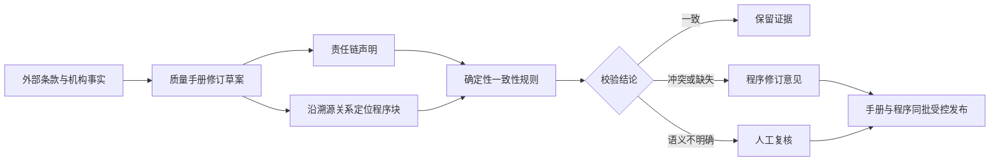

# 手册—程序一致性校验与责任链设计

- 日期：2026-07-13
- 状态：待用户审阅
- 适用系统：`jewelry-qms`
- 实施分支：`codex/manual-procedure-alignment`

## 目标

把现有“外部条款—手册—程序文件—记录/证据”溯源链从覆盖关系检查推进到内容一致性检查：先形成质量手册修订草案，再沿溯源关系定位受影响程序文件，自动识别可确定的冲突、缺失和责任链不一致，输出带证据的程序修订意见。

本功能不自动修改受控文件，也不把手册单独发布。手册草案及经确认的程序修订应在后续走同一受控批次发布，避免出现“新手册已经生效、旧程序仍在运行”的过渡冲突。

## 已确认决策

1. 采用“手册草案先行、程序溯源校验、同批受控发布”的路线。
2. 第一阶段只实现只读校验能力，以 5 份程序作为试点：`CX-08`、`CX-19`、`CX-20`、`CX-21`、`CX-32`。
3. 第一阶段不建立新的责任链页面；只有在试点能够稳定复现已知问题后，才进入第二阶段。
4. 岗位和职责需要单独治理，但系统中的活动级责任链是唯一结构化来源；质量手册附录和程序职责节均由该来源生成或校验，不再维护一份彼此竞争的独立制度。
5. 第一阶段的验收不依赖大模型或外部网络。规则无法可靠定性的内容必须进入人工复核，不得静默判为通过。

## 业务流程

## 第一阶段：5 份程序只读试点

### 输入

- 一份显式指定的质量手册结构化草案或测试夹具。校验器不得直接修改当前已发布手册。
- 系统当前版本的 `CX-08`、`CX-19`、`CX-20`、`CX-21`、`CX-32` 及其结构化块。
- 当前系统已有的条款、要素、手册块、程序文件和程序块溯源关系。
- 用于验收的精简测试材料，覆盖本设计的已知问题。测试材料不得包含生产敏感数据。

输入版本必须在报告中记录文档 ID、版本号、内容哈希和提取时间。缺少版本信息或文档无法唯一定位时，校验停止并报告阻断项。

### 候选程序块定位

校验按以下顺序收窄候选范围：

1. 从手册草案声明的外部条款、体系要素和手册章节出发。
2. 优先使用现有的手册块链接、要素—文件映射和程序块位置链接定位候选程序。
3. 对已纳入试点但缺少直接链接的程序，登记“溯源覆盖缺口”，并在该程序的职责、正文、相关文件和记录节中执行有限兜底检索。
4. 不在试点范围内的程序不进入第一阶段判定，避免将全库关键词命中误报成当前修订影响。

缺少链接不能被判为“一致”；其结论至少为 `review_required`，同时给出应补的映射方向。

### 要求原子与规则

校验器把手册草案中的可判定声明转成“要求原子”，每个原子至少包含：

- 唯一标识、来源条款和手册块；
- 主体或责任岗位；
- 动作及其允许、禁止或强制属性；
- 对象、条件、频次、时限、数量或保存年限；
- 所需记录、表单或引用文件；
- 适用范围和场所；
- 原文证据片段及定位。

第一阶段只实现确定性规则，覆盖：

1. 数字和时限冲突，例如保存 `6 年` 与 `3 年`。
2. 允许/禁止冲突，例如“允许授权手写划改”与“不允许手写改动”。
3. 同一文件中的版本升级条件、次数和目标版次矛盾。
4. 正文所要求的记录/表单与“记录”节列示项目缺失或错挂。
5. 活动的编制、组织、审核、批准、执行、验证和保管岗位冲突。
6. 引用文件编号、名称和版本不一致。

只靠词面无法判断的近义表述、职责边界和机构适用性，不由规则强行定案，统一进入人工复核。

### 校验结果

每条结果只能使用以下状态：

- `consistent`：在指定范围内找到可追溯且无冲突的承接证据。
- `conflict`：手册与程序、程序内部或责任链之间存在明确矛盾。
- `missing`：要求已明确，但受影响程序没有承接内容或应有记录。
- `review_required`：映射、别名、适用性或语义不足，需人工确认。
- `not_applicable`：适用性事实已由用户或能力范围证据确认不适用。

每条发现必须输出：`finding_id`、状态、严重性、规则编号、条款/要素、手册块、程序及程序块、期望要求原子、观察到的内容、证据片段和定位、修订方向、输入版本哈希。

修订方向只描述“应统一到哪个已确认要求、涉及哪些位置”，不自动生成或写回受控正文。

### 实现形态

第一阶段在 `jewelry-qms` 内新增可复用的只读校验服务及命令行入口：

- 服务负责读取结构化输入、解析要求原子、沿溯源链选取候选块、运行规则并生成统一结果。
- 命令接受明确的手册草案路径、试点程序编号和输出目录；默认输出 JSON、CSV 和 Markdown 三种报告。
- 默认及唯一的第一阶段运行模式为只读；命令不提供发布、写库或自动修文参数。
- 输入无效、版本不唯一或规则执行异常时返回非零退出码，并在报告中列出阻断原因。

具体类名、命令名和文件位置在实现计划中按当前项目结构确定，避免设计稿提前固化与框架惯例不一致的命名。

### 已知问题验收矩阵

| 编号 | 试点文件 | 期望能力 | 期望结论 |
|---|---|---|---|
| Y14 | CX-08 | 识别手册允许授权手写划改与程序禁止手写改动的冲突 | `conflict` |
| Y15 | CX-19 | 识别“至少再保存 6 年”与“再保存 3 年”的冲突 | `conflict` |
| Y17 | CX-08 | 识别正文与附录的修改次数、目标版次互相矛盾 | `conflict` |
| Y18 | CX-21 | 识别正文管理评审表单与记录节错挂 BG-20 内审表单 | `missing` 或 `conflict` |
| Y13 | CX-20/CX-21/CX-32 | 定位制定、主持、批准等责任岗位不一致并列出证据 | `conflict` 或 `review_required` |

Y13 只有在岗位名称已能通过官方名称或已确认别名唯一归一时才判 `conflict`；否则必须判 `review_required`，不得猜测“总经理”“实验室主任”“经理”等称谓是否为同一岗位。

## 第二阶段：活动级责任链

第二阶段仅在第一阶段验收通过并经用户再次确认后实施。

### 治理原则

- 现有 `qms_element_responsibilities` 保留为要素级概览，不承担活动级批准链判定。
- 新责任链按“管理活动”记录，而不是仅按条款或文件记录。
- 岗位使用系统正式岗位 ID；历史文件中的称谓通过受控别名表归一。
- 每项责任必须保留来源手册块/程序块、适用场所、版本、状态和生效日期。
- 责任链不替代任命书、授权书或培训记录；这些材料作为岗位履职证据关联。

### 活动级职责类型

首批职责类型固定为：

1. 编制/组织；
2. 审核；
3. 批准/决策；
4. 执行；
5. 验证；
6. 记录保管；
7. 会签/咨询；
8. 知会。

其中批准/决策岗位默认要求唯一；确需多人批准时必须显式记录审批顺序或适用条件。

### 建议数据结构

新增活动级责任分配表，核心字段包括：机构、要素、活动标识和名称、正式岗位、职责类型、场所/范围、来源块与证据、版本、状态、生效日期。

新增岗位别名表，核心字段包括：机构、正式岗位、别名、适用场所、状态、确认说明。未确认别名不得自动参与冲突判定。

第二阶段页面建议设在策划中心的“责任链”入口，提供活动—岗位矩阵、来源证据、版本变更和异常提示。页面编辑只更新责任链草案；正式生效仍走受控确认流程。

### 责任链校验

系统至少提示以下问题：

- 使用了无法归一的岗位别名；
- 强制活动缺少批准者、执行者或验证者；
- 同一适用条件下出现多个未排序的批准者；
- 手册责任链与程序职责/正文不一致；
- 岗位责任与系统角色/RBAC 能力明显不匹配；
- 跨场所活动未标明协调、批准或记录归属。

这些提示只形成整改建议，不自动改变岗位、RBAC 或受控文件。

## 验证策略

1. 采用测试先行：先用精简材料编写 Y14、Y15、Y17、Y18 和 Y13 的失败测试，再实现最小规则使其通过。
2. 单元测试覆盖要求原子解析、数值比较、允许/禁止极性、岗位别名、记录表匹配和状态分流。
3. 集成测试使用隔离的临时数据库或固定导出夹具验证溯源定位；不得连接或写入生产数据库。
4. 运行 5 份试点程序后，逐条人工对照证据位置，确认报告能复现验收矩阵中的问题。
5. 增加反误报测试：无关程序不报警；缺映射不得静默通过；相同要求不得误报冲突；歧义岗位不得自动合并。
6. 运行前后比较输入文件哈希和相关数据表计数/快照，证明校验未修改源文件和数据库。
7. 实现验证使用隔离的 Docker/PHP 环境。本机终端当前没有直接可用的 PHP 运行时，因此不把宿主机 `php` 命令作为验收前提。

## 安全边界

- 不写生产数据库，不调整现有条款、映射、岗位、角色或权限。
- 不修改当前已发布质量手册、程序文件或 `knowledge/internal/` 导出层。
- 不自动修订正文，不发布、不部署、不推送远端。
- 不把关键词命中直接当作合规结论；所有结论必须保留上下文证据。
- 不把“没有找到”自动写成“不适用”；`not_applicable` 必须有明确机构事实或能力范围证据。
- 第一阶段未验收前，不创建责任链表、页面或迁移。

## 第一阶段验收标准

- 5 份试点程序全部完成只读校验并形成 JSON、CSV、Markdown 报告。
- 稳定复现 Y14、Y15、Y17、Y18；Y13 至少形成带位置证据的责任冲突或人工复核候选。
- 每条发现可从外部条款/手册块追溯到具体程序块和证据片段。
- 缺映射、岗位歧义和适用性不明均进入人工复核，不出现静默通过。
- 反误报测试、单元测试和集成测试通过。
- 源文件哈希和生产数据在运行前后保持不变。
- 形成是否进入第二阶段责任链建设的量化评估：命中率、误报数、人工复核数、缺映射数和预计维护成本。

## 暂不实施事项

- 全部 37 份程序的批量校验。
- 使用大模型自动解释或自动改写受控文件。
- 手册第五版和程序文件的正式修订、审批及发布。
- 责任链主数据、数据库迁移、页面和 RBAC 联动。
- 记录表格改版及真实运行证据补录。

