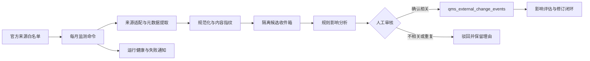

# 法规动态监测与受控变更设计

- 版本：v0.1
- 日期：2026-07-14
- 状态：设计已获方向批准，待书面规格复核
- 适用项目：`jewelry-qms`
- 设计口径：每月自动检查官方来源，生成候选清单；经人工确认后进入 LIMS 正式变更事件台账，并给出初步影响范围

## 1. 目标

建立一条可审计、可回退、人工最终决策的法规与认可要求查新链路，使系统能够：

1. 每月检查与珠宝玉石检测实验室有关的官方来源；
2. 识别新增或发生实质变化的公告、规范文件、标准和能力项目库信息；
3. 去重后生成隔离的候选清单；
4. 给出初步适用性和影响范围，且明确证据与不确定性；
5. 由授权人员确认后，才转入现有 `qms_external_change_events` 正式台账；
6. 后续沿用既有“登记 → 评估 → 修订 → 关闭/不适用归档”状态链闭环。

本设计落实 CNAS-CL01:2018 8.3 的外来文件控制、8.5 的风险与机遇处置，以及 7.11 的数据和信息管理控制。AI 只辅助发现和分析，不代替机构作出适用性、批准或发布决定。

## 2. 成功标准

第一版达到以下结果即验收合格：

- 每月 1 日 09:00（Asia/Shanghai）自动执行，也支持管理员手工触发；
- 每个启用来源均有成功、失败或需要人工处理的明确检查结果；
- 同一文号、规范化链接和内容指纹不会重复生成候选；
- 候选至少包含官方来源、标题、文号、链接、发布日期、生效日期、内容指纹、发现时间和证据摘要；
- 初步影响结果至少覆盖能力范围/CMA 标志、CNAS 要求、体系文件、人员授权、检测资源和 LIMS 六类对象；
- 人工确认前不创建正式外部变更事件，不自动修改受控文件、权限、报告模板或业务记录；
- 人工确认后可幂等地生成一条 `qms_external_change_events` 记录，并保留候选、审核决定和正式事件之间的追溯关系；
- 以市场监管总局 2026 年第 14 号“一单一库”公告完成一次端到端验收。

## 3. 非目标

第一版不实现：

- 抓取或保存所有标准全文；
- 绕过验证码、登录或网站访问限制；
- 承诺对互联网公告零漏报；
- 由 AI 自动认定文件适用或不适用；
- 自动发布受控文件、自动改变能力范围或自动允许使用 CMA/CNAS 标志；
- 自动创建 CAPA、培训或修订任务；
- 代替文件管理员执行月度人工兜底查新。

## 4. 方案选择

采用“独立监测器 + LIMS 受控确认 + 技能复核”的混合架构。

### 4.1 为什么不采用技能包单独查新

技能包适合语义判断和解释，但不适合独自承担固定时间调度、幂等去重、运行健康和长期审计。若仅靠 AI 会话，难以证明某月是否完成了所有来源检查。

### 4.2 为什么不把全部抓取逻辑直接写进控制器

官方页面结构会变化，来源采集与 LIMS 受控业务的失败模式不同。将采集器独立为命令和适配器，可在不影响正式变更台账的情况下单独修复、测试和降级。

### 4.3 混合架构的职责

- **独立监测器：**定时访问白名单官方来源、提取元数据、计算指纹、去重并生成候选。
- **规则影响引擎：**用确定性规则和现有追溯数据生成初步影响范围；不依赖 AI 才能完成月度运行。
- **技能包：**对候选进行官方来源复核、适用性分析和解释增强；输出始终标记为建议。
- **LIMS：**展示候选、记录人工决定、提升为正式变更事件并承接后续闭环。

## 5. 总体流程



“进入 LIMS”在本设计中特指候选被提升为正式受控变更事件。候选收件箱属于隔离的待确认数据，不视为现行外来文件或组织决定。

## 6. 官方来源范围

第一版启用以下来源类别：

| 来源 | 监测对象 | 第一版策略 |
|---|---|---|
| 市场监管总局认可检测司 | CMA 公告、评审准则、管理办法、常见问题解答 | 监测列表页和公告元数据 |
| 国家认监委 | 资质认定、认证认可相关公告 | 监测公告列表及文号 |
| CNAS 实验室认可 | 最新通知、认可准则、应用说明、指南和规则 | 监测通知页及规范文件目录 |
| 国家标准信息公共服务平台 | 珠宝玉石、贵金属检测相关标准状态 | 以已登记标准号为查询输入，不做全站漫游 |
| CMA 能力项目库 | “一单一库”动态信息 | 优先读取公开元数据；遇到登录、验证码或动态页面时转人工核查 |
| 新疆市场监管部门 | 与本机构直接有关的地方通知 | 监测公开通知列表，失败时人工兜底 |

来源清单使用配置文件维护，每个来源记录：`source_key`、主管机构、入口 URL、适配器类型、允许域名、关注主题、启用状态、预期检查频率和人工兜底说明。

所有来源只允许访问配置白名单域名，禁止由用户提交任意 URL 让服务器抓取。

## 7. 调度与采集

### 7.1 命令边界

新增独立命令，建议入口：

```text
php think qms:monitor-regulatory-changes
```

支持参数：

- `--source=<source_key>`：只检查一个来源；
- `--dry-run`：只生成运行报告，不写候选；
- `--since=<YYYY-MM-DD>`：限定回看日期；
- `--fixture-dir=<path>`：测试时读取本地固定样本，禁止联网。

### 7.2 定时执行

- 云端测试环境每月 1 日 09:00（Asia/Shanghai）运行；
- 正式环境投用前重新确认调度时间；
- 允许系统管理员手动补跑；
- 同一调度周期使用互斥锁，禁止并发重复运行。

### 7.3 采集原则

1. 优先读取官方 RSS、结构化接口或稳定列表页；
2. 只提取公开元数据和用于判断变化的最小证据；
3. 为链接做规范化，去除无关追踪参数；
4. 内容指纹基于规范化标题、文号、发布日期、正文摘要或附件元数据；
5. 不执行页面脚本，不解析不受支持的可执行附件；
6. 设置连接超时、响应大小上限、内容类型白名单和重试次数。

## 8. 数据边界

### 8.1 监测运行记录

新增 `qms_regulatory_monitor_runs`，至少记录：

- 运行编号、触发方式、开始和结束时间；
- 计划检查、成功、失败、需人工处理的来源数；
- 新增、重复、更新的候选数；
- 总体状态：`running`、`success`、`partial_failed`、`failed`；
- 错误摘要、执行版本和配置版本；
- 创建人或系统触发标识。

### 8.2 隔离候选收件箱

新增 `qms_external_change_candidates`，至少记录：

- 来源键、来源项目标识、规范化链接；
- 标题、文号、文件类型；
- 发布日期、生效日期、首次发现和最后确认仍存在时间；
- 内容指纹、证据摘要和证据引用；
- 相关度：`high`、`medium`、`low`、`unknown`；
- 初步适用性：`likely_applicable`、`needs_review`、`likely_not_applicable`；
- 初步影响 JSON、分析规则版本、置信度和判断理由；
- 审核状态：`pending`、`confirmed`、`rejected`、`duplicate`；
- 审核人、审核时间、审核意见；
- 提升后的正式事件 ID。

候选不得直接写入 `qms_sources`，不得被现行文件查询当作有效依据。

### 8.3 正式事件复用

人工确认时调用现有 `ExternalChangeEventService` 创建 `qms_external_change_events`，字段映射如下：

| 候选 | 正式事件 |
|---|---|
| 标题 | `source_name` |
| 官方链接 | `source_url` |
| 文号 | `announcement_number` |
| 发布/生效日期 | `published_date` / `effective_date` |
| 初步摘要 | `event_summary`，标明“机器初判，待人工评估” |
| 来源类别 | `source_kind` |
| 当前图快照 | `graph_snapshot_hash` |

提升动作必须幂等；候选已有关联事件时再次提交只能返回原事件，不得重复创建。

## 9. 初步影响分析

### 9.1 先规则、后 AI

月度任务必须在没有 AI 服务时仍可完成。第一版先使用：

- 来源类别与文号规则；
- 标题和摘要关键词；
- 已登记标准号、现行外来依据和能力范围项目；
- `qms_sources`、条款、结构化文件块和块级链接；
- 现有 `graph_snapshot_hash` 所代表的追溯图状态。

技能包或 AI 只在规则结果上补充解释、建议搜索词和可能遗漏，不覆盖确定性证据。

### 9.2 六类影响标签

每条候选至少输出以下六类中的零到多项：

1. `cma_scope_mark`：CMA 能力范围、证书或标志使用；
2. `cnas_accreditation`：CNAS 准则、规则、应用说明和认可义务；
3. `qms_documents`：手册、程序、作业指导书、表格和外来文件台账；
4. `personnel_authorization`：关键岗位、授权签字、能力和培训；
5. `methods_resources`：方法、设备、标准物质、环境、能力验证；
6. `lims_rules`：权限、字段、报告模板、校验规则和定时任务。

每个影响项必须带：对象类型、对象 ID 或检索线索、影响等级、命中依据、证据链接和“需人工确认”标识。

### 9.3 影响等级

- **直接影响：**文号、标准号或明确条款与现行对象直接匹配；
- **可能影响：**主题相关但尚缺能力范围、版本或场所证据；
- **未发现关联：**当前追溯图没有命中，不等于确认不适用。

系统不得把“没有找到关联”自动写成“不适用”。

## 10. 人工确认与权限

### 10.1 审核职责

- 文件管理员：核对来源、版本、文号、日期和附件；
- 质量负责人：决定是否提升为正式变更事件；
- 总体或场所技术负责人：复核技术、方法和能力范围影响；
- LIMS 系统管理员：维护调度和采集器，不得单独批准候选进入正式台账。

一人兼任多个角色时，系统仍应区分“技术维护”和“业务批准”动作，并保留不同动作的时间与身份。正式环境原则上不得由同一账号完成采集器维护、候选审核和事件批准的完整闭环。

### 10.2 审核动作

- **确认相关：**生成正式外部变更事件；
- **驳回：**必须选择原因并填写说明；
- **标记重复：**关联既有候选或正式事件；
- **请求技术复核：**保持 `pending`，记录待核事项；
- **重新分析：**使用新规则版本重算，不覆盖旧分析记录。

## 11. 页面设计

在现有“规划 → 变更事件”旁新增“法规监测”入口，包含：

1. **运行健康：**上次执行、各来源结果、失败原因、下次计划时间；
2. **候选清单：**按相关度、来源、发布日期和状态筛选；
3. **候选详情：**官方证据、内容指纹、初步影响、规则版本和历史分析；
4. **人工审核：**确认、驳回、重复、请求技术复核；
5. **正式事件链接：**提升后跳转现有变更事件详情页。

页面不得把候选显示为“现行依据”，并应始终展示“机器发现/初判，未经机构确认”的提示。

## 12. 故障与异常处理

| 场景 | 系统行为 |
|---|---|
| 单个来源访问失败 | 本次运行标记 `partial_failed`，保留错误和旧指纹，不宣称“无更新” |
| 所有来源失败 | 标记 `failed`，向系统管理员和质量负责人发通知 |
| 页面结构变化 | 适配器标记“疑似解析失效”，转人工核查 |
| 列表数量异常骤降 | 不删除既有候选，产生数据质量告警 |
| 同一候选重复出现 | 更新 `last_seen_at`，不新增记录 |
| 文号相同但内容指纹变化 | 作为候选更新版本，要求人工判断是否为勘误或实质变化 |
| AI 不可用 | 保留规则分析结果，月度任务仍成功完成 |
| 正式事件创建失败 | 候选保持 `pending`，记录失败，不出现半提升状态 |

同一来源连续两次失败时，系统必须生成高优先级人工查新提醒。

## 13. 安全与审计

- 采集器只访问白名单域名，防止 SSRF；
- 对 URL、HTML、PDF 元数据和显示内容进行转义与净化；
- 下载大小、类型、跳转次数和超时均有限制；
- 不在日志中记录 API 密钥、Cookie 或个人敏感信息；
- 候选审核、重新分析、提升、驳回和重复关联均写入字段审计；
- 保留采集器版本、来源配置版本、规则版本和图快照 hash；
- 正式事件创建继续复用现有附件、状态和审计机制；
- 变更监测本身属于计算机化系统功能，投用前按 CNAS-CL01 7.11.2 完成确认。

## 14. 技能包边界

配套技能包建议命名为 `qms-regulatory-change-monitor`，职责限定为：

- 核对候选是否来自官方一手来源；
- 判断正式公告、征求意见、解读和历史文件的效力层级；
- 对照 CNAS/CMA/珠宝检测领域要求分析适用性；
- 给出初步影响和待人工核验问题；
- 生成统一格式的人工审核摘要。

技能包不得直接连接生产数据库、批准候选、发布文件或声称法规监测无遗漏。它应复用系统导出的候选 JSON 和追溯摘要，不自行维护第二套正式台账。

## 15. “一单一库”验收案例

使用以下官方材料作为固定验收样本：

- 市场监管总局 2026 年第 14 号公告；
- 《检验检测机构资质认定“一单一库”常见问题解答》；
- 公告附件及公开的能力项目库入口信息。

期望生成一条候选，并至少命中：

- `cma_scope_mark`：能力项目库范围和 CMA 标志使用；
- `qms_documents`：外来文件台账、合同评审、报告控制和能力范围管理文件；
- `personnel_authorization`：授权签字人和相关人员培训；
- `lims_rules`：报告模板标志控制、能力项目与报告签发校验。

人工确认后生成正式事件；在完成本机构能力项目逐项对照前，事件不得关闭。

官方依据：

- https://www.samr.gov.cn/zw/zfxxgk/fdzdgknr/rkjcs/art/2026/art_ea608a4306a34b8bb1f3c548a91cffa8.html
- https://www.samr.gov.cn/rzjgs/xczl/art/2026/art_b1a54b8398da4f03a910ad0f8c1c2afb.html

## 16. 测试策略

### 16.1 单元测试

- URL 规范化和内容指纹稳定性；
- 文号、日期和文件类型提取；
- 来源适配器固定样本解析；
- 去重、同文号内容变化和幂等提升；
- 六类影响标签和“无命中不等于不适用”；
- 状态和权限校验。

### 16.2 集成测试

- 固定样本运行，不访问互联网；
- 部分来源失败仍生成正确运行报告；
- 候选确认后只创建一条正式事件；
- 驳回、重复、重新分析和审计记录完整；
- AI 服务关闭时规则分析和正式提升仍可运行。

### 16.3 端到端测试

用“一单一库”固定样本完成：监测 → 候选 → 初步影响 → 人工确认 → 正式事件 → 影响评估待办。验证正式台账在人工确认前为零新增。

### 16.4 云端冒烟

- 定时命令在容器中可运行；
- 时区为 Asia/Shanghai；
- 网络失败、超时和来源结构变化均有可见结果；
- 页面权限、CSRF、审计和通知正常；
- 重启后候选、运行记录和正式事件持久化。

## 17. 分阶段实施

### 阶段 1：确定性骨架

来源配置、运行记录、候选收件箱、固定样本适配器、去重、人工审核和正式事件提升。

### 阶段 2：初步影响

六类规则标签、现有 `qms_sources` 和追溯图匹配、影响详情页，以及“一单一库”验收案例。

### 阶段 3：真实官方来源与调度

逐个启用官方来源适配器、云端月度调度、失败通知和人工兜底记录。

### 阶段 4：技能复核

建立技能包，读取候选导出而非直接写库；验证无官方证据时必须输出“待核”。

每个阶段单独验收。阶段 3 未通过前，不声称系统具备自动法规查新能力；阶段 4 未通过不影响确定性监测链路运行。

## 18. 交付与回退

- 数据库迁移只新增候选和运行记录表，不改变现有正式事件语义；
- 新入口受功能开关控制，默认关闭；
- 关闭功能开关或停止定时任务即可回退，不删除候选和审计记录；
- 正式事件仍由现有页面和状态机管理；
- 首次云端启用前完成数据库快照和迁移回退演练。

## 19. 待实现计划细化的文件范围

预计涉及：

- 新命令与来源适配器；
- 来源配置；
- 候选、运行记录模型和迁移；
- 初步影响服务；
- 候选控制器、页面和路由；
- 现有 `ExternalChangeEventService` 的幂等提升入口；
- 权限、审计、通知、定时任务和测试；
- 配套技能包及人工操作说明。

具体文件和任务拆分在本设计书面复核通过后，由实现计划确定。

## 20. 设计决定摘要

1. 选择每月自动检查，不采用每日高频监测；
2. 候选与正式事件严格分离；
3. 人工确认是进入正式台账的唯一通道；
4. 月度运行不依赖 AI；
5. AI/技能只增强解释，不替代证据和批准；
6. 复用现有外部变更事件台账和状态机；
7. 来源失败必须可见，不以“无更新”掩盖；
8. 以“一单一库”完成首个端到端验收。

## 变更记录

- v0.1，2026-07-14：根据用户批准的混合设计形成首版书面规格，等待书面复核。
