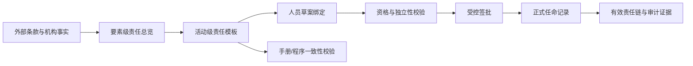

# 活动级责任链与人员任命设计

- 日期：2026-07-14
- 版本：v0.1
- 状态：待用户书面审阅
- 适用系统：`jewelry-qms`
- 当前分支：`codex/qms-governance-core`
- 前置成果：`2026-07-13-手册程序一致性与责任链-design.md` 及第一阶段只读校验器

## 1. 目标

在现有“外部条款—质量手册—程序文件—记录/证据”溯源链下，增加一层可执行的“管理活动—岗位—职责—具体人员”责任链。系统应允许机构先建立和测试责任结构，在人员尚未绑定、资格尚未校验或签批尚未完成时明确提示状态；只有完成资格校验和受控签批后，才形成正式任命与授权证据。

首版只覆盖内部审核、管理评审和风险管理三类活动，解决本轮文审已经发现的 Y13 职责矛盾族，并验证责任链能否作为手册与程序职责一致性校验的结构化基准。

本设计不自动修改受控文件，不自动授予软件权限，也不把内部系统签批冒充为 CNAS/CMA 对授权签字人等外部资格的认可。

## 2. 标准要求与机构选择

本功能主要承接以下要求：

- CNAS-CL01 5.5：定义组织结构，明确影响结果的人员职责和权限，并在必要范围内形成文件化程序。
- CNAS-CL01 5.6：为质量管理体系的建立、维护、偏离识别、措施启动和报告配备有权限与资源的人员。
- CNAS-CL01 6.2.2—6.2.6：记录胜任能力要求，传达职责与权限，实施选用、培训、监督、授权和能力监控并保留记录。
- CNAS-CL01 7.11.2—7.11.3：系统及其变更应经授权、留痕和验证，并保护数据完整性。
- CNAS-CL01 8.4、8.5、8.8、8.9：控制记录，处置风险与机遇，实施内部审核和管理评审。

上述条款要求实验室明确职责、确保胜任、实施授权并保留证据，但不强制指定“质量负责人”“办公室主任”等具体岗位名称。本文确定的岗位分工属于机构管理选择，不能表述为标准直接指定。

## 3. 已确认的组织事实与治理决定

1. “公司总经理/总经理”和“实验室主任”是两个不同岗位。
2. 实验室主任负责实验室活动、质量管理体系、内部审核、管理评审和一般风险的最终责任。
3. 公司总经理负责经营、财务、重大资源和重大法律事项。
4. “最高管理者”在现行实验室体系语境中归一为实验室主任。
5. “公司总经理”和“总经理”归一为公司总经理；“经理”单独出现时不得自动归一，必须人工确认。
6. 实验室主任的任命由公司总经理批准；其余 QMS 岗位和活动角色的任命由实验室主任批准。
7. 任何人不得批准自己的任命。
8. 页面选人只形成任命草案；资格校验和签批完成后，任命与内部授权才生效。
9. 未完成选人、校验或签批时，系统仍允许管理和测试“活动—岗位—职责”结构，并提示岗位尚未绑定人员。
10. 首版不把 QMS 任命自动同步为 RBAC 权限。

### 3.1 首次初始化边界

公司总经理是公司治理身份，不由实验室主任在 QMS 责任链中反向任命。首次启用时，系统管理员只能依据公司现有任职文件绑定公司总经理的员工身份并登记来源证据；该动作不得由管理员自行生成公司总经理任命。

公司总经理身份完成来源核验后，由其签批实验室主任。实验室主任任命生效后，才可签批其他 QMS 岗位和活动角色。若公司总经理身份尚未完成来源核验，所有责任结构仍可保存和测试，但不得形成正式任命。

## 4. 范围与非目标

### 4.1 首版范围

- 三条活动链：内部审核、管理评审、风险管理。
- 活动级责任结构、人员草案绑定、资格校验、签批和任命生成。
- 岗位标准名与受控别名。
- 手册、程序与责任链之间的只读差异校验。
- 版本、签批、任命和审计证据查询。

### 4.2 首版不做

- 不扩展至全部 27 个体系要素或全部程序文件。
- 不自动修改质量手册、程序文件或 `knowledge/internal/` 导出层。
- 不自动发布、换版或作废受控文件。
- 不自动授予或撤销 RBAC 权限。
- 不在本功能中处理 CNAS/CMA 授权签字人外部认可。
- 不将大模型判断作为签批或资格校验的唯一依据。

## 5. 总体架构

采用“结构和任命分层”的方案：

### 5.1 要素层

保留现有 `qms_element_responsibilities`，继续提供体系要素到岗位的总览，不承担活动步骤、批准顺序或具体人员任命。

### 5.2 活动责任层

以具体管理活动为单位，记录活动步骤、职责动作、标准岗位或活动角色、适用场所、是否必需、职责分离规则和来源证据。活动责任层是首版手册与程序职责校验的目标基准。

### 5.3 人员任命层

人员绑定与责任结构分离。草案阶段允许人员为空；签批生效后复用并扩展 `employee_appointments` 形成正式任命记录。更换人员不复制或破坏活动责任结构。

## 6. 职责类型与责任槽

首批职责类型固定为：

1. 编制/组织；
2. 审核；
3. 批准/决策；
4. 执行；
5. 验证；
6. 记录保管；
7. 会签/咨询；
8. 知会。

责任槽支持三种形式：

- **固定岗位**：质量负责人、实验室主任、技术负责人、资料管理员等稳定岗位。
- **活动角色**：审核组长等只在具体活动中成立的角色，应从满足资格条件的人员中指定，不新增为永久组织岗位。
- **动态责任人**：被审核活动责任岗位、风险措施责任人、管理评审改进责任人等，按具体活动范围指定。

批准/决策责任在同一适用条件下默认唯一。确需多人批准时，必须明确先后顺序、适用条件或升级规则。

## 7. 首批责任模板

### 7.1 内部审核

| 职责 | 标准岗位或角色 |
|---|---|
| 制定年度内审计划、组织整改跟踪 | 质量负责人 |
| 批准年度计划、范围和资源 | 实验室主任 |
| 编制实施计划、组织审核、形成报告 | 审核组长 |
| 执行审核 | 内审员，且不得审核自己的工作 |
| 实施更正、纠正或纠正措施 | 被审核活动的责任岗位 |
| 跟踪验证 | 审核组长或指定内审员 |
| 资料归档 | 资料管理员 |

### 7.2 管理评审

| 职责 | 标准岗位或角色 |
|---|---|
| 制定计划、协调输入、编制报告、跟踪措施 | 质量负责人 |
| 提供职责范围内的评审输入 | 各相关责任岗位 |
| 主持评审、作出决定、批准报告 | 实验室主任 |
| 实施改进措施 | 指定责任岗位 |
| 验证和关闭改进措施 | 质量负责人 |
| 资料归档 | 资料管理员 |

### 7.3 风险管理

| 职责 | 标准岗位或角色 |
|---|---|
| 识别和报告风险 | 各岗位人员或风险责任岗位 |
| 组织分析、综合评估、提出控制措施 | 质量负责人 |
| 技术类风险会签 | 技术负责人 |
| 批准一般风险措施和评估报告 | 实验室主任 |
| 实施风险措施 | 指定风险责任岗位 |
| 验证措施有效性 | 质量负责人或独立指定验证人 |
| 重大预算或法律事项最终批准 | 公司总经理 |
| 资料归档 | 资料管理员 |

办公室主任可承担协调和资料准备，但不作为上述三类活动的一般最终批准人。小型机构允许同一人兼任多个岗位，但内审独立性、风险执行与验证分离、禁止自我任命等约束仍然生效。

## 8. 页面设计

页面入口设在“策划中心 → 责任链”，包含四个视图。

### 8.1 责任结构

按活动展示环节、职责动作、责任槽、是否必需、适用场所、依据条款、关联手册和程序。未绑定人员时显示黄色“岗位尚未绑定人员”，但允许保存、预览和运行结构校验。

### 8.2 人员配置

在职责行中选择具体人员、场所和拟生效日期。选择动作形成草案绑定，不立即生成正式任命。兼岗允许保存，但必须由校验规则检查不相容职责。

### 8.3 校验与签批

“检查责任链”分别输出：

- 结构问题：职责断点、缺少批准/执行/验证/归档责任、批准顺序不明；
- 人员问题：未绑定、人员失效、场所不符、胜任证据不足；
- 独立性问题：自我批准、自我审核、执行与验证未分离；
- 文件问题：手册、程序与责任链岗位或职责动作不一致。

结构测试阶段，人员未绑定属于警告；提交签批时，必需岗位未绑定等问题升级为阻断。提交后冻结责任链版本和内容哈希。

### 8.4 有效责任链

展示“活动—岗位/角色—职责—具体人员—场所—有效期—批准人—来源版本”，并允许查看条款、手册、程序、胜任证据和签批记录。页面只提供来源查看和修订建议，不直接编辑受控文件。

## 9. 状态与数据流

为避免把版本状态、人员完备度和任命状态混为一谈，分别管理：

- 责任链版本：`draft`、`pending_approval`、`effective`、`superseded`、`revoked`；
- 校验结果：`pass`、`warning`、`blocker`，其中“人员未绑定”在结构测试阶段为 `warning`；
- 任命记录：`draft`、`active`、`revoked`、`expired`。

有效版本不可直接覆盖。修改责任或人员时，从当前有效版本复制新草案；新版本完成签批并整体生效后，旧版本才转为 `superseded`，避免责任空窗。

## 10. 建议数据模型

### 10.1 保留与扩展

- 保留 `qms_positions` 和 `qms_element_responsibilities`。
- `qms_positions` 新增标准岗位 `company_general_manager`（公司总经理）。
- 扩展 `employee_appointments`，关联来源责任链版本和责任项。

### 10.2 新增实体

1. **责任链版本**：链编号、版本号、状态、内容哈希、生效时间、替代版本、创建/锁定信息。
2. **责任活动**：所属版本、活动编号、名称、体系要素、适用场所、来源证据、排序。
3. **活动职责项**：活动步骤、职责类型、职责文字、责任槽类型、固定岗位或资格范围、必需性、职责分离规则、证据引用。
4. **人员草案绑定**：职责项、员工、场所、拟生效期、胜任证据引用或快照、校验状态。
5. **责任链签批**：版本、批准人及其岗位、决定、时间、意见、内容哈希和审计元数据。
6. **岗位别名**：正式岗位、别名、适用来源/场所、确认状态和说明。

具体表名、索引和字段类型在实现计划中按现有 ThinkPHP 与迁移惯例确定，但上述实体边界和关联关系不得合并成不可审计的单表。

## 11. 岗位别名治理

- `最高管理者` → `lab_director`，确认状态。
- `实验室主任` → `lab_director`，正式名称。
- `公司总经理`、`总经理` → `company_general_manager`，确认状态。
- `经理` → 保持 `review_required`，不得自动参与冲突定案。
- 历史文件中的其他名称变体逐项迁入别名数据；未确认别名只生成复核候选。

现有服务中写死的岗位别名应在本功能范围内逐步迁移到受控数据，但不得借机重构无关文档解析逻辑。

## 12. 校验与签批规则

### 12.1 草案阶段

- 责任结构和人员绑定均可分步保存。
- 必需人员为空只提示警告，不阻止结构测试和手册—程序差异校验。
- 草案不得作为正式任命、授权或评审证据。

### 12.2 提交前校验

提交签批必须满足：

1. 必需责任槽均已绑定人员或可解析的动态责任人；
2. 员工有效、场所相符、拟生效期合法；
3. 胜任要求和证据满足该岗位或活动角色；
4. 批准者唯一且不得是被任命人本人；
5. 不存在冲突的有效任命；
6. 内审员不得审核自己的工作；
7. 风险措施执行与有效性验证按配置实现分离；
8. 公司总经理身份及其来源证据已完成初始化核验。

### 12.3 签批与生效

- 实验室主任任命流转给公司总经理；其余 QMS 岗位和活动角色流转给已生效的实验室主任。
- 同一责任链版本、同一批准人可批量签批，但必须逐项展示被任命人员、职责范围和校验结论。
- 系统签批记录登录身份、员工身份、批准岗位、决定、时间、意见、版本哈希和审计事件。
- 签批、任命生成和版本切换必须在同一事务内完成；任一步失败则全部回滚，旧版本继续有效。
- 首版的系统签批属于机构内部受控记录，不宣称具备外部法律意义上的高级电子签名效力。

## 13. 与手册、程序和 RBAC 的关系

### 13.1 手册与程序

活动责任链是职责一致性校验的结构化目标基准。第一阶段只读校验器应读取有效责任链或指定草案，识别手册、程序中的岗位、职责动作和批准关系是否一致，并输出证据定位与修订方向。

首版不得自动生成或写回手册和程序正文。`knowledge/internal/` 继续作为结构化来源的单向导出层，不得手工编辑。

### 13.2 RBAC

业务任命回答“谁承担什么职责”，RBAC 回答“谁能操作什么系统功能”。首版只记录二者差异提示，不自动改变权限。后续若联动，必须另行设计最小权限、撤权时效、紧急访问和独立验证规则。

## 14. 权限边界

- 责任链草案的查看、编辑和提交沿用现有策划中心访问控制，并限制在获授权的管理人员。
- 签批资格不能只依赖页面角色或管理员设置，必须同时校验登录用户对应员工身份，以及有效批准岗位；公司总经理按 3.1 节的已核验公司治理身份处理，不要求先由 QMS 责任链反向生成其任命。
- 管理员可以维护系统配置和绑定来源证据，但不能代替公司总经理或实验室主任作出业务签批。
- 所有变更写入现有审计日志或等效的不可静默覆盖记录。

## 15. 实现顺序

1. 数据迁移和首批责任模板种子；模板仅以草案状态建立，不写入真实人员任命。
2. 岗位别名、结构校验、人员资格与独立性校验服务。
3. 签批、任命生成、版本切换和事务回滚。
4. “策划中心 → 责任链”页面及证据查看。
5. 接入第一阶段只读校验器，输出手册—程序—责任链差异。
6. 在隔离数据库完成自动测试、场景测试和用户页面验收。

正式数据库迁移、初始化真实身份或写入真实任命记录，必须在页面验收后再次取得用户明确授权。

## 16. 验证策略

### 16.1 自动测试

- 单元测试：状态流转、别名归一、固定/活动/动态责任槽、资格规则、批准路由、独立性和内容哈希。
- 集成测试：签批事务、任命生成、版本替代、失败回滚、审计记录和只读溯源校验。
- 权限测试：未授权编辑、管理员代签、自我签批、无有效批准岗位签批均被阻止。
- 回归测试：现有要素级责任总览、第一阶段一致性校验和既有 RBAC 行为不被改变。

自动测试只连接隔离测试数据库，不连接或写入生产数据库。

### 16.2 必测业务场景

1. 三条责任链未绑定任何人员时，可以保存、展示和运行结构校验，只显示黄色提醒。
2. 必需岗位未绑定、人员失效、场所不符或胜任证据不足时，阻止提交签批。
3. 实验室主任任命正确流转给公司总经理，其他任命正确流转给实验室主任。
4. 自我任命批准、内审员审核自己的工作、风险执行与验证冲突均被阻止或按明确规则提示。
5. 签批成功后生成正式 `employee_appointments`、版本哈希和完整审计轨迹。
6. 修改责任或人员时生成新草案；新版本签批前旧版本持续有效。
7. 签批或任命生成失败时整体回滚，不留下半生效记录。
8. 只读校验能识别 Y13：内审计划职责冲突、管理评审批准岗位冲突和风险批准岗位混用。
9. 运行前后 `knowledge/internal/`、受控文件和 RBAC 权限保持不变。

### 16.3 验收材料

- 自动测试和回归测试结果；
- 三条责任链场景测试清单；
- 手册—程序—责任链差异报告；
- 一份内部签批与任命证据样例；
- 数据库零污染、事务回滚和源文件未改验证记录。

## 17. 首版完成标准

- 内审、管理评审、风险管理三条责任模板可创建、查看、修改和版本化。
- 无人员绑定时能进行结构管理和校验，状态提示准确。
- 完成人员绑定、资格校验、签批、任命生成和历史查询闭环。
- 公司总经理与实验室主任保持独立身份和正确批准边界。
- 禁止自我批准，内审独立性等关键规则有效。
- 第一阶段校验器可以按责任链对照手册和程序，并复现 Y13 已知问题。
- 不修改受控文件、`knowledge/internal/` 或 RBAC 权限。
- 隔离环境验证完成，并形成可供用户复核的证据包。

## 18. 后续但不纳入本规格

- 将责任链扩展到全部体系活动和 37 份程序。
- 由责任链生成手册附录或程序职责节候选稿。
- QMS 任命与 RBAC 的受控联动。
- 授权签字人、检测人员等技术授权的专门资格模型。
- 真实生产数据迁移、正式任命启用和受控文件发布。

---

变更记录：v0.1 2026-07-14，依据六节对话确认结果形成；完成占位符、内部一致性、范围和歧义自检后，提交用户书面审阅。
